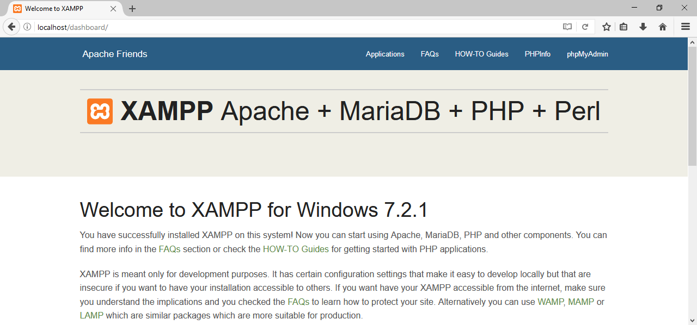

# Local Development Environment #

This guide is for the creation of a local
[CakePHP](https://cakephp.org/) development environment on Windows 10
(though it should work fine for other modern versions of Windows).

## Components ##

The tools we will be using for local development are as follows:

- [XAMPP](https://www.apachefriends.org)
- [Git Bash](https://git-scm.com/download/win)
- [Composer](https://getcomposer.org/)

## XAMPP Installation & Configuration ##

Grab a copy of the [XAMPP](https://www.apachefriends.org) installer,
and install it using the default options.  It should offer up a
suggested location of `C:\xampp`; if you change this location to
somewhere else, just change it accordingly in the following
instructions.

After XAMPP is installed, we need to configure PHP in order for
CakePHP to be happy.  The `intl` extension, which is needed by
CakePHP, is _included_ in XAMPP, but not _enabled_ (see
[here](https://book.cakephp.org/3.0/en/installation.html) for more
details).  To enable it, open up `C:\xampp\php\php.ini` in your
favorite text editor, and uncomment the line with the following:

```ini
extension=php_intl.dll
```

If this line doesn't exist, just add it to the bottom of the file (or
wherever it makes sense to add it).

Once that's done, head over to the XAMPP Control Panel and
start/restart Apache for the changes to take effect.


To test that Apache's working properly, just point your browser to
`localhost`.  You should see the default XAMPP welcome page.



## Git Bash ##

If you've been using Git in Windows already, you probably already have
[Git Bash](https://git-scm.com/download/win) installed.  If you don't,
go ahead and install it, or use whatever [Git
front-end](https://git-scm.com/download/gui/windows) you prefer.  This
guide, however, will assume you are using Git Bash for Windows.  We'll
use it to clone the [Website](https://github.com/csi4999-mims/Website)
repository from GitHub.

If you have already been communicating with GitHub over ssh in Git
Bash, great; you can skip this paragraph!  If you haven't, you can
either share an ssh key that Git Bash knows about with GitHub or you
can use an https connection.  Using an https connection is perfectly
fine, it just may require you to enter your GitHub credentials each
time you interact with GitHub.  For more details on how to share an
SSH key with GitHub, please check out [this
article](https://help.github.com/articles/connecting-to-github-with-ssh/).

<!-- We may need to create a tutorial on how to create an ssh key in
Git Bash ond share it with GitHub.  For the time being, though, I'll
just point them to some other resources. -->

We'll need the `C:\xampp\htdocs` directory to be completely empty in
order to clone our repository into it.  Here are the commands you can
run in Git Bash to back up the current `htdocs` directory, clear it
out, then clone the repo.  If you want to use an https connection
instead of an ssh connection, just replace
`git@github.com:csi4999-mims/Website.git` with
`https://github.com/csi4999-mims/Website.git`.

```bash
# head down into the xampp directory
cd /c/xampp

# make a backup of the current htdocs directory
cp -a htdocs htdocs.bak

# delete anything in the htdocs directory, including hidden files
# (e.g. .git)
find htdocs -mindepth 1 -delete

# clone the repository from GitHub
git clone git@github.com:csi4999-mims/Website.git htdocs
```

_Note_: Until the CakePHP files are merged with the master branch on
GitHub, you may need to use `git checkout` in the `htdocs` directory
to check out whatever branch has them available.  This will need to be
done before running Composer in the next section.

## Composer ##

### Installation ###

Though we have cloned the repo, not all the files necessary to run the
CakePHP site are in version control.  They are intentionally left out
because they contain things like site-specific configurations or
sensitive data (i.e. usernames and passwords).  To get all the
necessary files that are not in version control, we will use Composer,
then configure them for our local environment.

You can download a Windows installer package from
[getcomposer.org](https://getcomposer.org/Composer-Setup.exe).  Once
you install the package, you should have the `composer` command
available from cmd and from Git Bash.  To test whether Git Bash sees
the new `composer` command, just type `which composer`, and it should
show you something like `/c/ProgramData/ComposerSetup/bin/composer`.

### Update project tree ###

Run the following commands in Git Bash to "update" the project with
the missing files.

```bash
cd /c/xampp/htdocs
composer update
```

This should download and install a bunch of dependencies for the
project, then give you a bunch of "suggestions".  You can safely
ignore these suggestions, so long as you don't see any errors.


Next, we'll need to configure CakePHP for our local environment.

## CakePHP Environment Configuration ##

In the `htdocs` directory, there is a template file at
`config/app.default.php` which we will use as a starting point for our
own configuration file.  Just copy or rename this file to
`config/app.php`.

There is a section in that file for `Datasources`, which we will
modify for our environment.

```php
/**
 * Connection information used by the ORM to connect
 * to your application's datastores.
 * Do not use periods in database name - it may lead to error.
 * See https://github.com/cakephp/cakephp/issues/6471 for details.
 * Drivers include Mysql Postgres Sqlite Sqlserver
 * See vendor\cakephp\cakephp\src\Database\Driver for complete list
 */
'Datasources' => [
    'default' => [
        'className' => 'Cake\Database\Connection',
        'driver' => 'Cake\Database\Driver\Mysql',
        'persistent' => false,
        'host' => 'localhost',
        /**
         * CakePHP will use the default DB port based on the driver selected
         * MySQL on MAMP uses port 8889, MAMP users will want to uncomment
         * the following line and set the port accordingly
         */
        //'port' => 'non_standard_port_number',
        'username' => 'my_app',
        'password' => 'secret',
        'database' => 'my_app',
        'encoding' => 'utf8',
        'timezone' => 'UTC',
        'flags' => [],
        'cacheMetadata' => true,
        'log' => false,

        /**
         * Set identifier quoting to true if you are using reserved words or
         * special characters in your table or column names. Enabling this
         * setting will result in queries built using the Query Builder having
         * identifiers quoted when creating SQL. It should be noted that this
         * decreases performance because each query needs to be traversed and
         * manipulated before being executed.
         */
        'quoteIdentifiers' => false,

        /**
         * During development, if using MySQL < 5.6, uncommenting the
         * following line could boost the speed at which schema metadata is
         * fetched from the database. It can also be set directly with the
         * mysql configuration directive 'innodb_stats_on_metadata = 0'
         * which is the recommended value in production environments
         */
        //'init' => ['SET GLOBAL innodb_stats_on_metadata = 0'],

        'url' => env('DATABASE_URL', null),
    ],

    /**
     * The test connection is used during the test suite.
     */
    'test' => [
        'className' => 'Cake\Database\Connection',
        'driver' => 'Cake\Database\Driver\Mysql',
        'persistent' => false,
        'host' => 'localhost',
        //'port' => 'non_standard_port_number',
        'username' => 'my_app',
        'password' => 'secret',
        'database' => 'test_myapp',
        'encoding' => 'utf8',
        'timezone' => 'UTC',
        'cacheMetadata' => true,
        'quoteIdentifiers' => false,
        'log' => false,
        //'init' => ['SET GLOBAL innodb_stats_on_metadata = 0'],
        'url' => env('DATABASE_TEST_URL', null),
    ],
],
```

## Troubleshooting ##

Bash is a UNIX shell, and as such, is subject to most of the trappings
of UNIX environments.  It typically looks to the environment variable
`HOME` for your home directory.  If you find that the ssh key you
created in the [Git Bash](#git-bash) section ends up not working for
you, this may be the culprit.  Just add an environment variable `HOME`
which points to your `C:\Users\Username` directory (obviously
replacing `Username` with your _actual username_).


