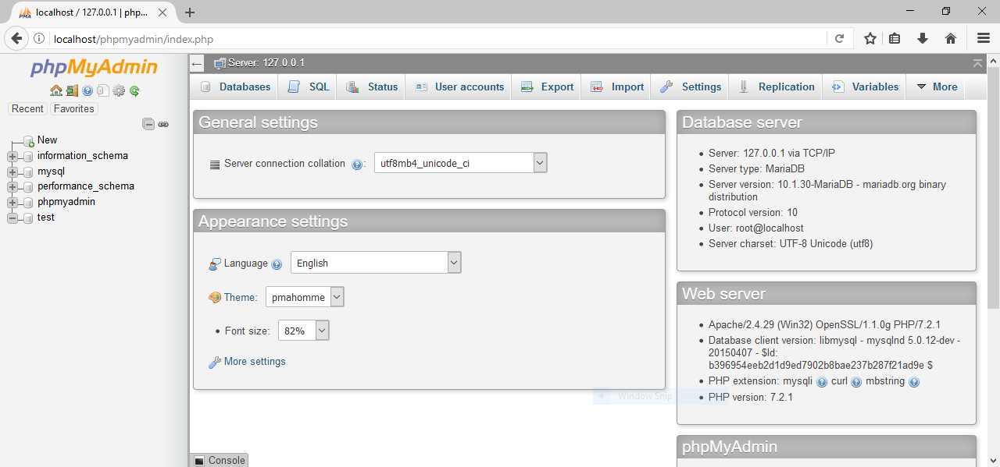

# Local Development Environment #

This guide is for the creation of a local
[CakePHP](https://cakephp.org/) development environment on Windows 10
(though it should work fine for other modern versions of Windows).

## Components ##

The tools we will be using for local development are as follows:

- [XAMPP](https://www.apachefriends.org)
- [Git Bash](https://git-scm.com/download/win)
- [Composer](https://getcomposer.org/)

## XAMPP Installation & Configuration ##

### Installation ###

Grab a copy of the [XAMPP](https://www.apachefriends.org) installer,
and install it using the default options.  It should offer up a
suggested location of `C:\xampp`; if you change this location to
somewhere else, just change it accordingly in the following
instructions.  It may also ask you if you would like to allow traffic
through the firewall over public and/or private networks for the
services it is installing.  Just select all the networks available and
click "Allow."

### Configuration ###

After XAMPP is installed, we need to enable the `intl` extension,
which is needed by CakePHP.  This extension is _included_ in XAMPP,
but not _enabled_ (see
[here](https://book.cakephp.org/3.0/en/installation.html) for more
details).

To enable it, open `C:\xampp\php\php.ini` in your favorite text
editor, and uncomment the following line if it exists, or add it to
the "Dynamic Extensions" list if it does not exist.

```ini
extension=intl
```

Once you've saved `php.ini`, head over to the XAMPP Control Panel and
start/restart Apache for the changes to take effect.


To test that Apache's working properly, just point your browser to
`localhost`.  You should see the default XAMPP welcome page.


## Git Bash ##

If you've been using Git in Windows already, you probably already have
[Git Bash](https://git-scm.com/download/win) installed.  If you don't,
go ahead and install it, or use whatever [Git
front-end](https://git-scm.com/download/gui/windows) you prefer.  This
guide, however, will assume you are using Git Bash for Windows.

If you have already been communicating with GitHub over ssh in Git
Bash, great; you can skip this paragraph!  If you haven't, you can
either share with GitHub an ssh key that Git Bash knows about, or you
can use an https connection.  Using an https connection is perfectly
fine, it just may require you to enter your GitHub credentials each
time you interact with GitHub.  For more details on how to share an
SSH key with GitHub, please check out [this
article](https://help.github.com/articles/connecting-to-github-with-ssh/).

<!-- We may need to create a tutorial on how to create an ssh key in
Git Bash and share it with GitHub.  For the time being, though, I'll
just point them to some other resources. -->

We'll need the `C:\xampp\htdocs` directory to be completely empty in
order to clone our repository into it.  Here are the commands you can
run in Git Bash to back up the current `htdocs` directory, clear it
out, then clone the repo.  If you want to use an https connection
instead of an ssh connection, just replace
`git@github.com:csi4999-mims/Website.git` with
`https://github.com/csi4999-mims/Website.git`.

```bash
# head down into the xampp directory
cd /c/xampp

# optional: make a backup of the current htdocs directory
cp -a htdocs htdocs.bak

# delete anything in the htdocs directory, including hidden files
# (e.g. .git)
find htdocs -mindepth 1 -delete

# clone the repository from GitHub into the htdocs directory
git clone git@github.com:csi4999-mims/Website.git htdocs
```

## Composer ##

### Installation ###

Though we have cloned the repo, not all the files necessary to run the
CakePHP site are in version control.  They are intentionally left out
because they contain things like environment-specific configurations
or sensitive data (i.e. usernames and passwords).  To get all the
necessary files that are not in version control, we will use Composer,
then configure them for our local environment.

You can download a Windows installer package from
[getcomposer.org](https://getcomposer.org/Composer-Setup.exe).  You
can accept all the defaults during installation.

Once you've installed Composer, you'll need to close and re-open Git
Bash in order for it to know about the `composer` command.  To test
whether Git Bash sees the new `composer` command, just type `which
composer`, and it should show you something like
`/c/ProgramData/ComposerSetup/bin/composer`.

### Update project tree ###

Run the following commands in Git Bash to "update" the project with
the missing files.

```bash
cd /c/xampp/htdocs
composer update
```

This should download and install a bunch of dependencies for the
project, then give you a bunch of "suggestions".  You can safely
ignore these suggestions, so long as you don't see any errors.


## Database Setup ##

### Database Creation ###

We need to set up a database for CakePHP to connect to.  To do this,
in the XAMPP Control Panel:

1. Start Apache if it is not already running.
2. Start MySQL if it is not already running.
3. Click the "Config" button for MySQL to open phpMyAdmin in your
   browser.



In phpMyAdmin, click on the "User accounts" tab at the top of the
page, and create a new user account and database for CakePHP.  Check
the box for "**Create database with same name and grant all
privileges**" to do this in one step.

| Field     | Recommended Value                    |
| ---       | ---                                  |
| User name | cake                                 |
| Host name | localhost                            |

Set the password to whatever you want, so long as you remember what it
is.


### Database Schema Import ###

- After selecting the database in phpMyAdmin, click on the "Import"
  tab on the top of the page.
- Click the Browse button to select the database schema file found in
  [CakeDocumentation/users_table.sql](../CakeDocumentation/users_table.sql).
- Scroll to the bottom of the page and click "Go".


## CakePHP Environment Configuration ##

In the `htdocs` directory, there is a template file at
`config/app.default.php` which we will use as a starting point for our
own configuration file.  Just copy or rename this file to
`config/app.php`.

There is a section in that file for `Datasources`, which we will
modify for our environment using the database information from above.

We need to add this database connection information twice: once for
the "default" database, and once for the "test" database.  Change the
`username`, `password`, and `database` fields to match what you set up
in the [Database setup](#database-setup) step.

Here's the "default" connection:

```php
'Datasources' => [
    'default' => [
        'className' => 'Cake\Database\Connection',
        'driver' => 'Cake\Database\Driver\Mysql',
        'persistent' => false,
        'host' => 'localhost',
        /**
         * CakePHP will use the default DB port based on the driver selected
         * MySQL on MAMP uses port 8889, MAMP users will want to uncomment
         * the following line and set the port accordingly
         */
        //'port' => 'non_standard_port_number',
        'username' => 'my_app', // change these fields
        'password' => 'secret', // change these fields
        'database' => 'my_app',	// change these fields
        'encoding' => 'utf8',
        'timezone' => 'UTC',
        'flags' => [],
        'cacheMetadata' => true,
        'log' => false,

```

And, farther down, there's the "test" connection:

```php
    /**
     * The test connection is used during the test suite.
     */
    'test' => [
        'className' => 'Cake\Database\Connection',
        'driver' => 'Cake\Database\Driver\Mysql',
        'persistent' => false,
        'host' => 'localhost',
        //'port' => 'non_standard_port_number',
        'username' => 'my_app',     // change these fields
        'password' => 'secret',		// change these fields
        'database' => 'test_myapp',	// change these fields
        'encoding' => 'utf8',
        'timezone' => 'UTC',
        'cacheMetadata' => true,
        'quoteIdentifiers' => false,
        'log' => false,
        //'init' => ['SET GLOBAL innodb_stats_on_metadata = 0'],
        'url' => env('DATABASE_TEST_URL', null),
    ],
],
```

Save and close the file when you're done.

## See your environment in action ##

Now just point your browser to `localhost` and see what happens!

## Troubleshooting ##

Bash is a UNIX shell, and as such, is subject to most of the trappings
of UNIX environments.  It typically looks to the environment variable
`HOME` for your home directory.  If you find that the ssh key you
created in the [Git Bash](#git-bash) section ends up not working for
you, this may be the culprit.  Just add an environment variable `HOME`
which points to your `C:\Users\Username` directory (obviously
replacing `Username` with your _actual username_).


