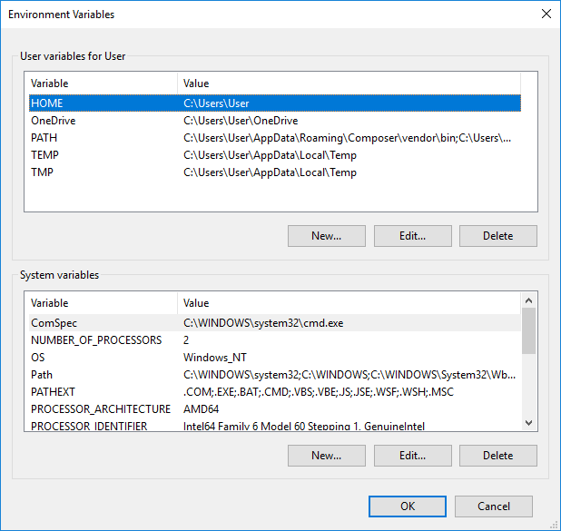

# Local Development Environment #

This guide is for the creation of a local
[CakePHP](https://cakephp.org/) development environment on Windows 10
(though it should work fine for other modern versions of Windows).

## Components ##

The tools we will be using for local development are as follows:

- [XAMPP](https://www.apachefriends.org)
- [Git Bash](https://git-scm.com/download/win)
- [Composer](https://getcomposer.org/)

## XAMPP Installation & Configuration ##

Grab a copy of the [XAMPP](https://www.apachefriends.org) installer,
and install it using the default options.  It should offer up a
suggested location of `C:\xampp`; if you change this location to
somewhere else, just change it accordingly in the following
instructions.

After XAMPP is installed, we need to configure PHP in order for
CakePHP to be happy.  The `intl` extension, which is needed by
CakePHP, is _included_ in XAMPP, but not _enabled_ (see
[here](https://book.cakephp.org/3.0/en/installation.html) for more
details).  To enable it, open up `C:\xampp\php\php.ini` in your
favorite text editor, and uncomment the line with the following:

```ini
extension=php_intl.dll
```

If this line doesn't exist, just add it to the bottom of the file (or
wherever it makes sense to add it).

Once that's done, head over to the XAMPP Control Panel and
start/restart Apache for the changes to take effect.


To test that Apache's working properly, just point your browser to
`localhost`.  You should see the default XAMPP welcome page.


## Git Bash ##

If you've been using Git in Windows already, you probably already have
[Git Bash](https://git-scm.com/download/win) installed.  If you don't,
go ahead and install it, or use whatever [Git
front-end](https://git-scm.com/download/gui/windows) you prefer.  This
guide, however, will assume you are using Git Bash for Windows.  We'll
use it to clone the [Website](https://github.com/csi4999-mims/Website)
repository from GitHub.

_Side Note_: If you have already been communicating with GitHub over
ssh, great!  If you haven't, please make sure you've shared your
public ssh key with GitHub, and that Git Bash knows to use that key.
If you have no idea what any of this means, know that you can safely
use the https method to clone the repository, but you may need to
enter your GitHub username and password each time.  For more details
on how to share an SSH key with GitHub, please check out [this
article](https://help.github.com/articles/connecting-to-github-with-ssh/).

<!-- How to set up your SSH key with GitHub and Git Bash may be part
of a future article. For the time being, though, we'll just move
on. -->

_Optional_: Open up `C:\xampp` in your file manager and make a backup
of the `htdocs` directory, just in case.

Head down into `C:\xampp\htdocs\` and delete everything that's in
there.  We'll need the directory to be empty for the next step.  Now,
in Git Bash, run the following commands:

```bash
cd /c/xampp
git clone git@github.com:csi4999-mims/Website.git htdocs
```

This will clone the Website repository into the `C:\xampp\htdocs`
directory.  If you want to use the https method instead of the ssh
method, just replace `git@github.com:csi4999-mims/Website.git` with
`https://github.com/csi4999-mims/Website.git`.

_Troubleshooting_: Until the CakePHP files are merged with the master
branch on GitHub, you may need to `git checkout` whatever branch has
them available before running the next set of commands.

## Composer ##

Though we have cloned the repo, not all the files necessary to run the
CakePHP site are in version control.  They are intentionally left out
because they contain site-specific configurations or sensitive data
(like passwords).  To get all the necessary files that are not in
version control, we will use `composer`.

## Troubleshooting ##

Bash is a UNIX shell, and as such, is subject to most of the trappings
of UNIX environments.  It typically looks to the environment variable
`HOME` for your home directory.  If you find that the ssh key you
created in the [Git Bash](#git-bash) section ends up not working for
you, this may be the culprit.  Just add an environment variable `HOME`
which points to your `C:\Users\Username` directory (obviously
replacing `Username` with your _actual username_).


