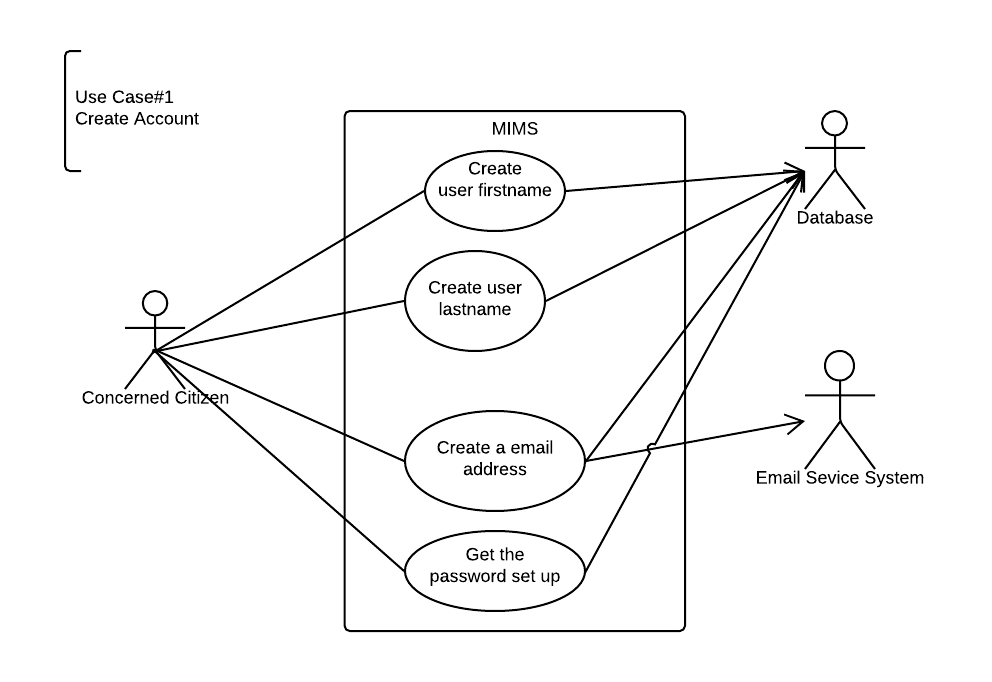

*WORKING DOCUMENT*

*Editors: Nicole Cox, Minqiang Hu*

# 4.3a User Stories

| #   | User Stories                                                                                                                                                                                                                                                                                                                                        | Requirements Covered |
| --- | ---                                                                                                                                                                                                                                                                                                                                                 | ---                  |
| 1   | As the Concerned Public or Law Enforcement I want to be able to create an account                                                                                                                                                                                                                                                                   | REQ 1                |
| 2   | As the Concerned Public or Law Enforcement I want to be able to login with my account                                                                                                                                                                                                                                                               | REQ 2                |
| 3   | As the Concerned Public or Law Enforcement I want to be able to update my account information                                                                                                                                                                                                                                                       | REQ 3                |
| 4   | As the Concerned Public or Law Enforcement I want to be able to gain access to my account if I get locked out                                                                                                                                                                                                                                       | REQ 4                |
| 5   | As an Application Administrator I want to be able to restrict user access via role management                                                                                                                                                                                                                                                       | REQ 7                |
| 6   | As an Application Administrator I want the application to verify a user\'s email address                                                                                                                                                                                                                                                            | REQ 5                |
| 7   | As an Application Administrator I want only one email to be associated with one user account                                                                                                                                                                                                                                                        | REQ 6                |
| 8   | As the Concerned Public I want an interface specific to my user type                                                                                                                                                                                                                                                                                | REQ 8                |
| 9   | As Law Enforcement I want an interface specific to my user type                                                                                                                                                                                                                                                                                     | REQ 9                |
| 10  | As an Application Administrator I want to have a website and mobile application version of the system                                                                                                                                                                                                                                               | REQ 10               |
| 11  | As the Concerned Public I want to be able to submit a new missing person report                                                                                                                                                                                                                                                                     | REQ 11               |
| 12  | As the Concerned Public when I submit a new report I want to be able to enter the Name of Parents, Parents Contact Info(email, phone, address), Victim's Name, Height, Weight, Color of Hair & Eyes, Additional Marks/Tattoos, Victim's DOB, Victim's Phone Number, Phone Contacts, and Social Media Accounts as they pertain to the missing person | REQ 12               |
| 13  | As Law Enforcement I want all new reports submitted by the Concerned Public to be classified as \"on hold\" until an official report number is associated with it                                                                                                                                                                                   | REQ 13               |
| 14  | As the Concerned Public I want the application to notify me to go to my local police station to complete the report process if not already done                                                                                                                                                                                                     | REQ 14               |
| 15  | As an Application Administrator I want all information submitted by the Concerned Public to be sent to Law Enforcement                                                                                                                                                                                                                              | REQ 15               |
| 16  | As Law Enforcement I want to be able to validate report information before it appears on the application                                                                                                                                                                                                                                            | REQ 16               |
| 17  | As Law Enforcement I want each missing person report that appears in the application to have an official report number associated with it                                                                                                                                                                                                           | REQ 17               |
| 18  | As an Application Administrator I want all reports approved by Law Enforcement to be displayed to the Concerned Public                                                                                                                                                                                                                              | REQ 18               |
| 19  | As Law Enforcement I want to be able to categorize the type of missing person                                                                                                                                                                                                                                                                       | REQ 19               |
| 20  | As the Concerned Public I want to be able to see the missing person\'s image, name, DOB, description, last known location when I use the application                                                                                                                                                                                                | REQ 20               |
| 21  | As Law Enforcement I want to be able to see all information about the missing person that is contained in the official report                                                                                                                                                                                                                       | REQ 21               |
| 22  | As the Concerned Public I want to be able to browse all current missing and found people                                                                                                                                                                                                                                                            | REQ 22               |
| 23  | As Law Enforcement I want the data about each missing person to be displayed in an easy to read format                                                                                                                                                                                                                                              | REQ 23               |
| 24  | As Law Enforcement I want to be able to update the information in the reports                                                                                                                                                                                                                                                                       | REQ 24               |
| 25  | As the Concerned Public I want to see any updates made by Law Enforcement in the application                                                                                                                                                                                                                                                        | REQ 25               |
| 26  | As Law Enforcement I want to be able to mark missing people as found                                                                                                                                                                                                                                                                                | REQ 26               |
| 27  | As Law Enforcement I want \"found\" people to remain in the application to notify the Concerned Public they are no longer missing                                                                                                                                                                                                                   | REQ 27               |
| 28  | As an Application Administrator I want the application to cycle out reports that are \"on hold\" after they have been in the system for 24 hours                                                                                                                                                                                                    | REQ 28               |
| 29  | As Law Enforcement I want to use missing people\'s social media accounts to track where they might be or be going                                                                                                                                                                                                                                   | REQ 29               |

# 4.3b Scenarios & Use Cases

## Use Case UC-#1: Create Account

|                       |                                                                                      |
| ---                   | ---                                                                                  |
| Related Requirements: | REQ 1                                                                                |
| Initiating Actor:     | Concerned Citizen                                                                    |
| Actor's Goals:        | To create a Concerned Citizen account in order to use the application                |
| Participating Actors: | Database, Concerned Citizen, Email Service                                           |
| Preconditions:        | The application is opened and the Concerned Citizen has chosen to create and account |
| Postconditions:       | The account is created and the Concerned Citizen can now login to the application    |

### Flow of Events for Main Success Scenario

| Direction | Number | Description                                                                                                                    |
| ---       | ---    | ---                                                                                                                            |
| →         | 1.     | Concerned Citizen opens the application and presses the "sign up" button                                                       |
| ←         | 2.     | The application redirects the Concerned Citizen to the registration page                                                       |
| ←         | 3.     | The Concerned Citizen is prompted to enter their first name, last name, email, password, and confirm password in textboxes     |
| →         | 4.     | The Concerned Citizen enters their first name, last name, email, password, and confirm password in the corresponding textboxes |
| ←         | 5.     | The information entered is verified                                                                                            |
| ←         | 6.     | The Concerned Citizens account is added to the Database                                                                        |

### Flow of Events for Alternate Scenario

| Direction | Number | Description                                                                                                                    |
| ---       | ---    | ---                                                                                                                            |
| →         | 1.     | The Concerned Citizen open the application and presses the "sign up" button                                                    |
| ←         | 2.     | The application redirects the Concerned Citizen to the registration page                                                       |
| ←         | 3.     | The Concerned Citizen is prompted to enter their first name, last name, email, password, and confirm password in textboxes     |
| →         | 4.     | The Concerned Citizen enters their first name, last name, email, password, and confirm password in the corresponding textboxes |
| ←         | 5.     | The application notifies the Concerned Citizen information already exists                                                      |
| ←         | 6.     | The Concerned Citizen is directed to the reset password page                                                                   |
                                                                                                                                                                                                                                                                      
### Responsibility Matrix

| Responsibility Description | Type | Concept Name    |
| ---                        | ---  | ---             |
| Access User Storage        | D    | Controller      |
| Container of All Users     | K    | UserStorage     |
| Email Service              | D    | EmailController |

## Use Case UC-#2: Login

|                       |                                                                                          |
| ---                   | ---                                                                                      |
| Related Requirements: | REQ 2                                                                                    |
| Initiating Actor:     | Concerned Citizen                                                                        |
| Actor's Goals:        | To login to their existing account to use the application                                |
| Participating Actors: | Database, Concerned Citizen                                                              |
| Preconditions:        | Concerned Citizen has opened the app, has an account created, and is on the login screen |
| Postconditions:       | The Concerned Citizen is logged in and is on the landing page                            |

### Flow of Events for Main Success Scenario

| Direction | Number | Description                                                                             |
| ---       | ---    | ---                                                                                     |
| →         | 1.     | The Concerned Citizen opens the application and is on the login screen                  |
| ←         | 2.     | The Concerned Citizen is prompted to enter their username and password in textboxes     |
| →         | 3.     | The Concerned Citizen enters their username and password in the corresponding textboxes |
| ←         | 4.     | The entered information is validated based on the information in the Database           |
| ←         | 5.     | The Database returns confirmation of the login information                              |
| ←         | 6.     | The application displays the landing page                                               |

### Flow of Events for Alternate Scenario

| Direction | Number | Description                                                                             |
| ---       | ---    | ---                                                                                     |
| →         | 1.     | The Concerned Citizen opens the application and is on the login screen                  |
| ←         | 2.     | The Concerned Citizen is prompted to enter their username and password in textboxes     |
| →         | 3.     | The Concerned Citizen enters their username and password in the corresponding textboxes |
| ←         | 4.     | The entered information is validated based on the information in the Database           |
| ←         | 5.     | The Database returns the login information as invalid                                   |
                                                                                                                                                                                                                                   
### Responsibility Matrix

| Responsibility Description | Type | Concept Name |
| ---                        | ---  | ---          |
| Access User Storage        | D    | Controller   |
| Container of All Users     | K    | UserStorage  |

## Use Case UC-#3: Update Account Info

|                       |                                                                                                            |
| ---                   | ---                                                                                                        |
| Related Requirements: | REQ 3                                                                                                      |
| Initiating Actor:     | Concerned Citizen                                                                                          |
| Actor's Goals:        | To update their existing account information                                                               |
| Participating Actors: | Database, Concerned Citizen, Email Service                                                                 |
| Preconditions:        | The Concerned Citizen has an account created, they are signed in, they are on the update account info page |
| Postconditions:       | The Concerned Citizen's account information is updated                                                     |

### Flow of Events for Main Success Scenario

| Direction | Number | Description                                                                                                            |
| ---       | ---    | ---                                                                                                                    |
| →         | 1.     | The Concerned Citizen enters their updated name and email in the appropriate textboxes                                 |
| ←         | 1.b    | If the Concerned Citizen updates their email a confirmation email is sent again similar to at initial account creation |
| ←         | 2.     | The Database updates the entered information                                                                           |
| ←         | 3.     | The application returns a success message to the Concerned Citizen                                                     |

### Flow of Events for Alternate Scenario

| Direction | Number | Description                                                                            |
| ---       | ---    | ---                                                                                    |
| →         | 1.     | The Concerned Citizen enters their updated name and email in the appropriate textboxes |
| ←         | 2.     | The Database updates the entered information                                           |
| ←         | 3.     | The Database returns an error and does not update the information                      |
                                                                                                                                                                                                                                                                                    
### Responsibility Matrix

| Responsibility Description | Type | Concept Name     |
| ---                        | --   | ---              |
| Access User Storage        | D    | Controller       |
| Container of All Users     | K    | UserStorage      |
| Email Service              | D    | Email Controller |

## Use Case UC-#4: Update Password

|                       |                                                                                                        |
| ---                   | ---                                                                                                    |
| Related Requirements: | REQ 4                                                                                                  |
| Initiating Actor:     | Concerned Citizen                                                                                      |
| Actor's Goals:        | To change their password to regain access to their account                                             |
| Participating Actors: | Database, Concerned Citizen, Email Service                                                             |
| Preconditions:        | The Concerned Citizen has an account, they forgot their password, they are on the forgot password page |
| Postconditions:       | The Concerned Citizen regains access to their account with a new password                              |

### Flow of Events for Main Success Scenario

| Direction | Number | Description                                                                                        |
| ---       | ---    | ---                                                                                                |
| →         | 1.     | The Concerned Citizen enters their email in the appropriate textbox                                |
| →         | 2.     | The Concerned Citizen clicks the Reset Password button                                             |
| ←         | 3.     | The application sends an email to the entered address                                              |
| →         | 4.     | The Concerned Citizen clicks on the reset link in the email                                        |
| ←         | 5.     | The application redirects the Concerned Citizen to the reset password page                         |
| →         | 6.     | The Concerned Citizen enters their new password in the first textbox and confirms it in the second |
| ←         | 7.     | The Database updates the Concerned Citizen's password                                              |
| ←         | 8.     | The application displays a success message to the Concerned Citizen                                |

### Flow of Events for Alternate Scenario

| Direction | Number | Description                                                                                        |
| ---       | ---    | ---                                                                                                |
| →         | 1.     | The Concerned Citizen enters their email in the appropriate textbox                                |
| →         | 2.     | The Concerned Citizen clicks the Reset Password button                                             |
| ←         | 3.     | The application sends an email to the entered address                                              |
| →         | 4.     | The Concerned Citizen clicks on the reset link in the email                                        |
| ←         | 5.     | The application redirects the Concerned Citizen to the reset password page                         |
| →         | 6.     | The Concerned Citizen enters their new password in the first textbox and confirms it in the second |
| ←         | 7.     | The Database returns an error and does not update the password                                     |
                                                                                                                                                                                                                                                            
### Responsibility Matrix

| Responsibility Description | Type | Concept Name |
| ---                        | ---  | ---          |
| Access User Storage        | D    | Controller   |
| Container of All Users     | K    | UserStorage  |

## Use Case UC-#5: Verify Email Address

|                       |                                                                                                                                                                            |
| ---                   | ---                                                                                                                                                                        |
| Related Requirements: | REQ 5, REQ 6                                                                                                                                                                      |
| Initiating Actor:     | Email Service                                                                                                                                                              |
| Actor's Goals:        | To validate a Concerned Citizen's email                                                                                                                                    |
| Participating Actors: | Email Service, Concerned Citizen, Database                                                                                                                                 |
| Preconditions:        | The Concerned Citizen is creating an account OR is updating their email address if they have a pre-existing account AND has entered their email in the appropriate textbox |
| Postconditions:       | The Concerned Citizens email is validated                                                                                                                                  |

### Flow of Events for Main Success Scenario

| Direction | Number | Description                                                                                                                            |
| ---       | ---    | ---                                                                                                                                    |
| ←         | 1.     | The Email Service sends an email to the entered address                                                                                |
| →         | 2.     | The Concerned Citizen opens the email                                                                                                  |
| →         | 3.     | The Concerned Citizen clicks the verify link in email                                                                                  |
| ←         | 4.     | The application successfully creates the account OR updates the email of an existing account AND allows the Concerned Citizen to login |

### Flow of Events for Alternate Scenario

| Direction | Number | Description                                                                                         |
| ---       | ---    | ---                                                                                                 |
| ←         | 1.     | The Email Service sends an email to the entered address                                             |
| ←         | 2.     | The email fails to send due to an invalid email                                                     |
| →         | 3.     | The Concerned Citizen cannot continue with successful account creation OR updating of their account |
                                                                                                                                                                                                                                                                                                                                                                    
### Responsibility Matrix

| Responsibility Description | Type | Concept Name    |
| ---                        | ---  | ---             |
| Access User Storage        | D    | Controller      |
| Container of All Users     | K    | UserStorage     |
| Email Service              | D    | EmailController |

## Use Case UC-#6: View as Public
|                       |									|
| ---                   | ---									|
| Related Requirements: | REQ 8									|
| Initiating Actor:	| Concerned Public							|
| Actor's Goals:	| To see an interface specific to their user type			|
| Preconditions:	| The Concerned Public has an account created				|
| Postconditions:	| The Concerned Public views a landing page specific to their user type |

### Flow of Events for Main Success Scenario

| Direction | Number | Description														|
| ---	    | ---    | ---															|
| ->	    | 1.     | The Concerned Public opens the application										|
| <-	    | 2.     | The application prompts the Concerned Public to login with their credentials						|
| ->	    | 3.     | The Concerned Public enters their username(email) and password in the corresponding fields				|
| <- 	    | 4.     | The database verifies the Concerned Public's credentials and identifies their user type based on the entered credentials |
| <- 	    | 5.     | The Concerned Public is directed to the landing (home) page								|

### Flow of Events for Alternate Scenario

| Direction | Number | Description										   |
| ---	    | ---    | ---											   |
| -> 	    | 1.     | The Concerned Public opens the application						   |
| <-	    | 2.     | The application prompts the Concerned Public to login with their credentials		   |
| -> 	    | 3.     | The Concerned Public enters their username(email) and password in the corresponding fields  |
| <-	    | 4.     | The database verifies the Concerned Public's credentials, but cannot verify their user type |
| <-	    | 5.     | The application displays and error to the Concerned Public				   |

### Responsibility Matrix

| Responsibility Description | Type | Concept Name |	
| ---			     | ---  | ---	   |
| Access User Storage	     | D    | Controller   |
| Container of All Users     | K    | UserStorage  |

## User Story UC-#7: View as Law Enforcement
|			|								   |
| ---			| ---								   |
| Related Requirements: | REQ 9								   |
| Initiating Actor:	| Law Enforcement						   |
| Actor's Goals:	| To see an interface specific to their user type		   |
| Participating Actors: | Database							   |
| Preconditions:	| Law Enforcement has an account created			   |
| Postconditions:	| Law Enforcement views a landing page specific to their user type |

### Flow of Events for Main Success Scenario

| Direction | Number | Description													 |													
| --	    | ---    | ---														 |
| ->	    | 1.     | Law Enforcement opens the application										 |
| <-	    | 2.     | The application prompts Law Enforcement to login with their credentials						 |
| ->	    | 3.     | Law Enforcement enters their username(emails) and password in the corresponding fields 				 |
| <-	    | 4.     | The database verfies Law Enforcement's credentials and identifies ther user type based on the entered credentials |
| <-	    | 5.     | Law Enforcement is directed to the ladning (home) page								 |

### Flow of Events for Alternate Scenario

| Direction | Number | Description										|
| ---	    | ---    | ---											|
| ->	    | 1.     | Law Enforcement opens the application							|
| <- 	    | 2.     | The application prompts Law Enforcement to login with their credentials			|
| ->	    | 3.     | Law Enforcement enters their username(email) and password in the corresponding fields    |
| <-	    | 4.     | The database verifies Law Enforcement's credentials, but cannot identify their user type |
| <-	    | 5.     | The application displays an error to Law Enforcement

### Responsibility Matrix

| Responsibility Description | Type | Concept Name |
| --			     | ---  | ---	   |
| Access User Storage	     | D    | Controller   |
| Container of All Users     | K    | UserStorage  |

## User Story UC-#8: Submit New Report
|			|										      |
| ---			| ---										      |
| Related Requirements: | REQ 11, REQ 12, REQ 13, REQ 14						      |
| Initiating Actor:	| Concerned Public						            	      |
| Actor's Goals:	| To submit a new missing person report						      |
| Participating Actors:	| Database									      |
| Preconditions:	| The Concerned Public has an account, is logged in, and is on the Submit Report page |
| Postconditions:	| A new missin person report has been submitted and is "on hold" 		      |

### Flow of Events for Main Success Scenario

| Direction | Number | Description
| --- 	    | ---    | ---
| ->	    | 1.     | The Concerned Public fills in the following fields on the form about the missing person: Name* (text), Name of Parents (text), Height* (number), Weight* (number), DOB* (number), Color of Hair* (text), Color of Eyes* (text), Marks/Tattoos (text), Phone (text), Social Media Accounts (text), Photo (jpg, png, etc.), Family/Friends Contact Info (text), submitter relation to missing (text), Workplace (text), Hangouts (text), Last Seen Location* (text) [fields marked with * are required] |
| -> 	    | 2.     | The Concerned Public submits the form 									 |
| <- 	    | 3.     | The database saves all of the entered form data and assigns it a unique ID 				 |
| <- 	    | 4.     | The database flags the submitted report as "on hold"							 |
| <-	    | 5.     | The application notifies the Concerned Public to visit the nearest police station to complete the process |

### Flow of Events for Alternate Scenario

| Direction | Number | Description
| ---	    | ---    | ---												
| ->	    | 1.     | The Concerned Public fills in the following fields on the form about the missing person: Name* (text), Name of Parents (text), Height* (number), Weight* (number), DOB* (number), Color of Hair* (text), Color of Eyes* (text), Marks/Tattoos (text), Phone (text), Social Media Accounts (text), Photo (jpg, png, etc.), Family/Friends Contact Info (text), submitter relation to missing (text), Workplace (text), Hangouts (text), Last Seen Location* (text) [fields marked with * are required] |
| ->	    | 2.     | The Concerned Public submits the form									       |
| <-	    | 3.     | The form is not properly submitted because the Concerned Public missed filling in one of the Required(*) fields |
| <-	    | 4.     | The application displays an error message to the Concerned Public to fill in all required fields		       |

### Responsibility Matrix

| Responsibility Description 		  | Type | Concept Name     |
| --- 					  | ---  | ---              |
| Container of All Users 	  	  | K    | UserStorage      |
| Container of All Missing Person Reports | K    | ReportStorage    |
| Access Report Storage			  | D    | ReportController |

### User Case diagrams

