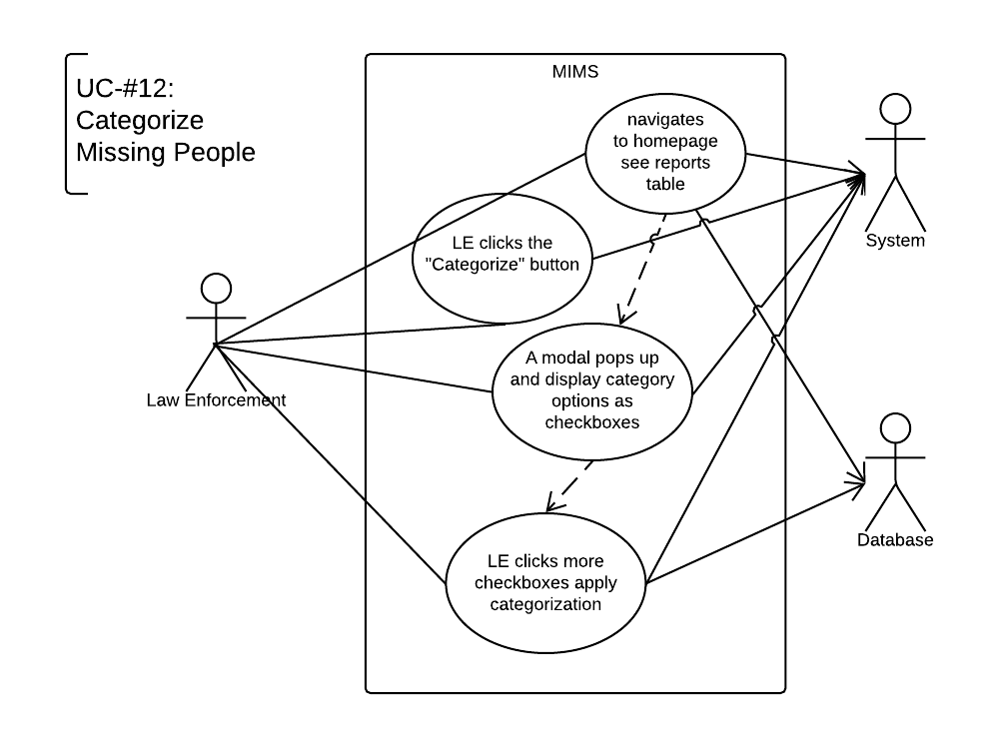
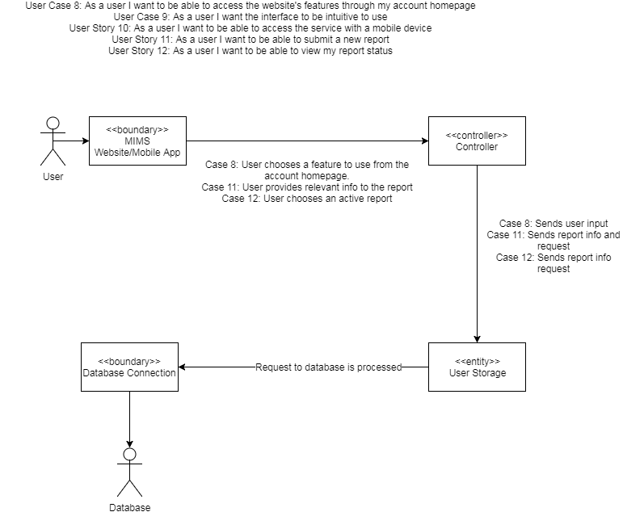
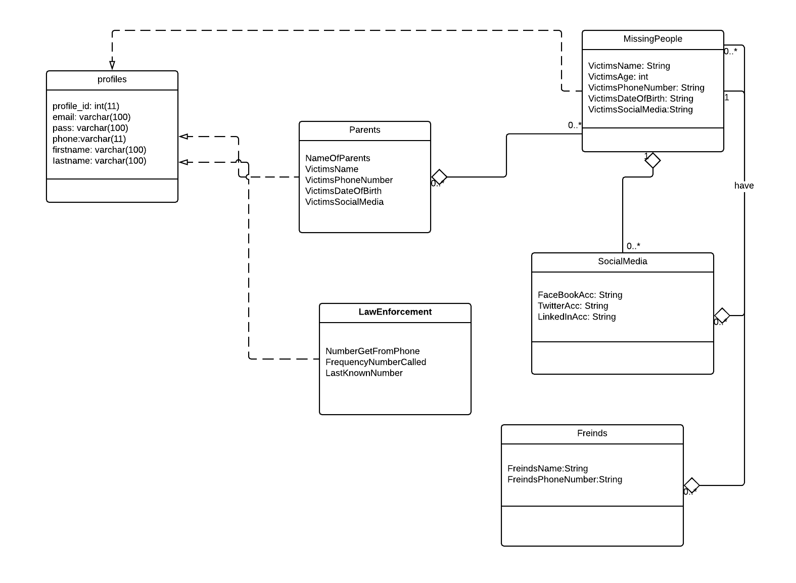
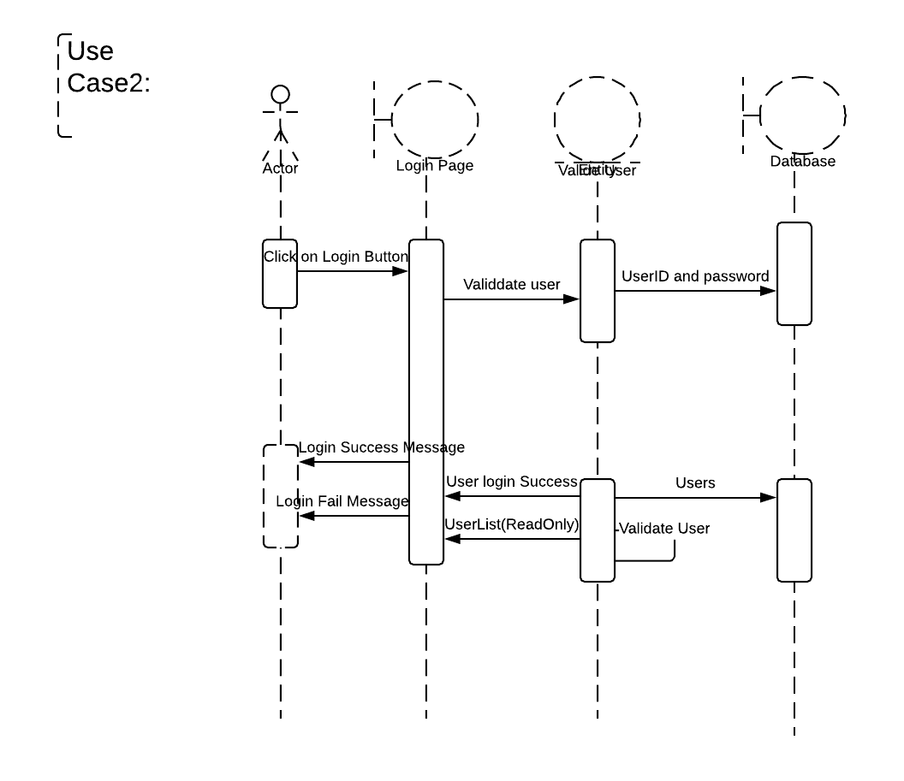

<!-- -*- mode: gfm; -*- -->

# Missing In Michigan System (MIMS)

<!--

To update the table of contents below, run the following from the
'Master Documentation' directory:

    doctoc --maxlevel 3 README.md

Check out https://github.com/thlorenz/doctoc for installation and
usage instructions.

-->

<!-- START doctoc generated TOC please keep comment here to allow auto update -->
<!-- DON'T EDIT THIS SECTION, INSTEAD RE-RUN doctoc TO UPDATE -->
## Table of Contents

- [Team Members](#team-members)
- [Section 1](#section-1)
  - [1.1 Background](#11-background)
  - [1.2 Socioeconomic Impact, Business Objectives, and Gap Analysis](#12-socioeconomic-impact-business-objectives-and-gap-analysis)
  - [1.3 Security and Ethical Concerns](#13-security-and-ethical-concerns)
  - [1.4 Glossary of Terms](#14-glossary-of-terms)
- [Section 2](#section-2)
  - [2.1 Team Information](#21-team-information)
  - [2.2 Tools and Technology](#22-tools-and-technology)
  - [2.3 Project Plan](#23-project-plan)
  - [2.4 Best Standards and Practices](#24-best-standards-and-practices)
- [Section 3](#section-3)
  - [3.1 Functional Requirements](#31-functional-requirements)
  - [3.2 Non-Functional Requirements](#32-non-functional-requirements)
  - [3.3 On-Screen Appearance of Pages Requirements](#33-on-screen-appearance-of-pages-requirements)
  - [3.4 Wireframes](#34-wireframes)
- [Section 4](#section-4)
  - [4.1 – 4.2 Stakeholders, Actors, and Goals](#41--42-stakeholders-actors-and-goals)
  - [4.3 User Stories, Scenarios, and Use Cases](#43-user-stories-scenarios-and-use-cases)
  - [4.4 System Sequence Activity Diagrams](#44-system-sequence-activity-diagrams)
- [Section 5](#section-5)
  - [5.1 Preliminary Design](#51-preliminary-design)
  - [5.2 User Efforts Estimation](#52-user-efforts-estimation)
- [Section 6](#section-6)
  - [6.1 Class Model](#61-class-model)
  - [6.2 System Operation Contracts](#62-system-operation-contracts)
  - [6.3 Mathematical Model](#63-mathematical-model)
  - [6.4 Entity Relationship Diagram](#64-entity-relationship-diagram)
- [Section 7](#section-7)
  - [7.1 Sequence Diagrams](#71-sequence-diagrams)
  - [7.2 Interface Specification](#72-interface-specification)
  - [7.3 State Diagrams](#73-state-diagrams)
- [Section 8](#section-8)
  - [8.1 Subsystems and Component Design Patterns](#81-subsystems-and-component-design-patterns)
  - [8.2 Mapping Subsystem to Hardware Deployment](#82-mapping-subsystem-to-hardware-deployment)
  - [8.3 Persistent Data Storage](#83-persistent-data-storage)
  - [8.4 Network Protocol](#84-network-protocol)
  - [8.5 Global Control Flow](#85-global-control-flow)
  - [8.6 Hardware Requirements](#86-hardware-requirements)
- [Section 9](#section-9)
  - [9.1 Algorithms](#91-algorithms)
  - [9.2 Data Structures](#92-data-structures)
- [Section 10](#section-10)
  - [10.1 User Interface Design](#101-user-interface-design)
  - [10.2 User Interface Implementation](#102-user-interface-implementation)
- [Section 11](#section-11)
  - [11.1 Unit Test Architecture and Strategy Framework](#111-unit-test-architecture-and-strategy-framework)
  - [11.2 Unit Test Definition and Data Selection](#112-unit-test-definition-and-data-selection)
  - [11.3 System Test Specification](#113-system-test-specification)
  - [11.4 Test Reports Per Sprint](#114-test-reports-per-sprint)
- [Section 12](#section-12)
  - [12.1 Project Plan](#121-project-plan)
  - [12.2 Risk Management](#122-risk-management)
- [13. References](#13-references)
  - [13.1 Unit Testing](#131-unit-testing)
  - [13.2 Creating Views in CakePHP](#132-creating-views-in-cakephp)
  - [13.3 CakePHP Models](#133-cakephp-models)
  - [13.4 Login/Register Example](#134-loginregister-example)
  - [13.5 Installing CakePHP](#135-installing-cakephp)
  - [13.6 Google Maps Helper](#136-google-maps-helper)
  - [13.7 Bootstrap Helper](#137-bootstrap-helper)
  - [13.8 Chart.js](#138-chartjs)

<!-- END doctoc generated TOC please keep comment here to allow auto update -->

## Team Members

- Nicole Cox
- Bryan Derr
- Minqiang Hu
- Alex Morey
- Mitchell Roe
- Tyler Watling

## Section 1

### 1.1 Background

Missing Persons is a section of Law Enforcement that handles cases
involving people who have gone missing for a variety of reasons
including drug use, runaways, human trafficking, etc. The process of
finding missing people is extremely taxing for Law Enforcement because
it is usually like trying to find a needle in a haystack. Law
Enforcement resources dedicated to handling missing persons cases are
often limited and it can be a time consuming process for Law
Enforcement to gather and analyze all the information related to a
missing person.  The information provided by their family, friends,
phones, and social media accounts can be very helpful to Law
Enforcement if organized in a meaningful way. The concerned public
could also be an untapped resource in helping law enforcement find
missing persons. Unfortunately, there is no existing method that would
allow the public to contribute in the search for missing persons in a
quick, easy and convenient manner.

### 1.2 Socioeconomic Impact, Business Objectives, and Gap Analysis

#### 1.2.1 Socioeconomic Impact

People of all social and economical backgrounds and characteristics
will be able to fully utilize the MIMS software to find their missing
friends and loved ones. MIMS will also change the beliefs and
attitudes towards the process on how to recover a missing person,
allowing for the concerned personnel to feel more comfortable that
their missing are in good hands.

#### 1.2.2 Business Objectives

The business objectives of the MIMS application are to provide a
platform that can contribute to the ongoing process of reporting and
locating missing people. The purpose is to provide a platform that can
allow law enforcement and the concerned public to interact and engage
in the process of tracking down people who were reported as
missing. The application needs to also provide law enforcement with a
way to easily manage and analyze data at a quick glance through the
use of tables and charts.

#### 1.2.3 Gap Analysis

The current process of locating missing people does not involve the
active use of the knowledge of the concerned public in a useful
way. Law enforcement is often tasked with finding missing people with
limited resources and without an easy way to use the concerned
public's knowledge about where a missing person might be or have
been. With the use of MIMS, law enforcement and the concerned public
can have a platform to view missing people, provide comments about
different cases, and interact more proactively when trying to locate
missing people. The platform will also aim to provide the friends and
family of to feel more involved in the process and more comforted in
their time of trouble.

### 1.3 Security and Ethical Concerns

The data that is collected and analyzed in a missing person's case is
extremely sensitive and needs to be restricted to only certain users.
The personal information about a missing person that is provided by
their family, friends, phone, and social media accounts is private and
should only be accessible by Law Enforcement. The balance between
sharing enough information to the public to be helpful and maintaining
the privacy of the missing person is vital to the integrity of the
application. The data must be stored in a secure way and controlled
via role management.

Some of the ethical concerns that are related to the application are
that people who have access to the sensitive data might use it for
personal gain or inappropriate reasons. Also, some issues of how
ethical social media mining and analysis might be can come up. This
concern can be mitigated by ensuring that all users of the application
consent to the use of social media mining for any person they report
missing. Users of social media also already agree to have their data
publicized to a certain extent on platforms such as Facebook and
Twitter.

### 1.4 Glossary of Terms

<dl>

<dt>Missing Person</dt> <dd>An individual who has gone missing</dd>

<dt>Runaway</dt> <dd>An individual who has chosen to run away for
various reasons</dd>

<dt>Human Trafficking</dt> <dd>Organized criminal activity in which
human beings are treated as possessions to be controlled and
exploited</dd>

<dt>Criminal Activity</dt> <dd>An activity that is defined as illegal
by law</dd>

<dt>Drug Use</dt> <dd>The use of illegal or prescription substances</dd>

<dt>Romeo & Juliet</dt> <dd>A scenario where two individuals run away
with the intended purpose of being together in a relationship</dd>

<dt>Police Report</dt> <dd>An official report filed at a police
station</dd>

<dt>Illegal</dt> <dd>Not according or authorized by law</dd>

<dt>Legal</dt> <dd>Conforming or permitted to by law</dd>

<dt>Search Warrant</dt> <dd>A warrant authorizing a search</dd>

<dt>LEIN</dt> <dd>Law Enforcement Information Network, is used by
police to manage information including traffic stops, crimes, missing
people, etc.</dd>

<dt>Facebook</dt> <dd>Social media network</dd>

<dt>Twitter</dt> <dd>Social media network</dd>

<dt>Social Media Mining</dt> <dd>The process of using social media
information to analyze and develop patterns</dd>

<dt>Victim</dt> <dd>One that is subjected to oppression, hardship, or
mistreatment</dt>

<dt>Law Enforcement</dt> <dd>The department of people who enforce the
law, investigate crimes, and make arrests</dd>

<dt>Concerned Public</dt> <dd>The general public who is interested in
helping Law Enforcement</dd>

</dl>

## Section 2

### 2.1 Team Information

- Nicole Cox
    - Project Management
    - Website UI Development
    - Website Functionality Development
    - Documentation
- Bryan Derr
    - Mobile Application Development and Research
    - Documentation
- Minqiang Hu
- Alex Morey
- Mitchell Roe
    - Systems Administration
    - Database Administration
    - DevOps
    - Documentation
- Tyler Watling
    - Database
    - Website Functionality
    - Documentation

### 2.2 Tools and Technology

#### 2.2.1 Project Management & Revision Management

For project management our team used Microsoft Project 2013, Slack,
Google Drive, and GitHub.

#### 2.2.2 Front End Development

For Front End Development our team used Bootstrap, HTML, CSS, and
JavaScript.

#### 2.2.3 Back End Development

For Back End Development our team used the [CakePHP
Framework](https://cakephp.org/).

#### 2.2.4 Server

The MIMS server is a Debian 9 (codename "stretch") 64-bit server
hosted by [Linode](http://linode.com/).  It has the following software
installed to support the MIMS system:

- Apache 2.4
- PHP 7.0
- MariaDB 15.1
- PHPUnit 5.4.6
- Composer 1.2.2

### 2.3 Project Plan

#### 2.3.1 Gantt Chart

Click [here](media/MIMS_Project_Plan_FINAL_Gantt.pdf) for the Gantt
chart PDF file.

#### 2.3.2 Task Breakdown

Click [here](media/MIMS_Project_Plan_FINAL_Tasks.pdf) for the task
breakdown PDF file.

### 2.4 Best Standards and Practices

#### 2.4.1 CakePHP Basics

We are using CakePHP version 3.x, which is significantly different
from the 2.x version of CakePHP.  As such, please make sure when
browsing online help that you are looking at help for CakePHP version
3.

##### CakePHP File Structure

###### Model

The `Model` directory contains three subdirectories which make up the
model.

1. `Table`
2. `Entity`
3. `Behavior`

Model files use the `.php` extension.

###### Table

Table objects provide access to the collection of entities stored in a
specific table.  This is similar to the standard Model in MVC.

The table file name is the plural controller name followed by "Table"
(e.g. `UsersTable.php`).

###### Entity

Entities represent individual rows or domain objects in the app.

The entity file name is the singular controller name
(e.g. `User.php`).

###### Behavior

Behaviors are used for packaging behaviors that are common across many
models.

###### Template (View)

The template (view) files use the `.ctp` file extension.

The view files go in "Template/PLURAL CONTROLLER NAME"
(e.g. `Template/Users`).

Views must have a function in the controller in order to be rendered.

###### Controller

The controllers use the `.php` file extension.

The `AppController.php` file comes with the install of CakePHP.

The Controller is plural (e.g. `UsersController.php`).

#### 2.4.2 Git Basic Commands

###### Clone a repo

``` shell
git clone <repo name> [destination]

```

For example:

``` shell
git clone https://github.com/csi4999-mims/documentation.git
```

(The `[destination]` is optional.)

###### Get the latest from the repo

``` shell
git pull
```

###### Check for unstaged changes

``` shell
git status
```

###### Stage changes

``` shell
git add -A
```

OR

``` shell
git add
```

###### Commit changes

``` shell
git commit -m "my commit message"
```

###### Push changes

``` shell
git push
```

#### 2.4.3 Bootstrap Helper Documentation

<https://holt59.github.io/cakephp3-bootstrap-helpers/>

##### Installation

To install the Bootstrap Helper for CakePHP you need to run the
following commands or add the following code:

``` shell
composer require holt59/cakephp3-bootstrap-helpers:dev-master
```

Add this line to `config/bootstrap.php`:

``` php
Plugin::load('Bootstrap');
```

Add these lines to `AppController.php`:

``` php
public $helpers = [
    'Form' => [
        'className' => 'Bootstrap.Form'
    ],
    'Html' => [
        'className' => 'Bootstrap.Html'
    ],
    'Modal' => [
        'className' => 'Bootstrap.Modal'
    ],
    'Navbar' => [
        'className' => 'Bootstrap.Navbar'
    ],
    'Paginator' => [
        'className' => 'Bootstrap.Paginator'
    ],
    'Panel' => [
        'className' => 'Bootstrap.Panel'
    ]
];
```

Add these lines to `Layout/default.ctp`:

``` html+php
<?php
echo $this->Html->css('https://maxcdn.bootstrapcdn.com/bootstrap/3.3.7/css
/bootstrap.min.css');
echo $this->Html->script([
    'https://code.jquery.com/jquery-1.12.4.min.js',
    'https://maxcdn.bootstrapcdn.com/bootstrap/3.3.7/js/bootstrap.min.js'
]);
?>
```

##### Using the Helpers

###### Modal Helper

A modal is a window that can dynamically pop up when you specify it
to. For example when someone presses a button on the screen a modal
can pop up.

###### Modal using CakePHP Syntax

<https://holt59.github.io/cakephp3-bootstrap-helpers/modal-helper/basics/>

``` html+php
<?php
    // Start a modal with a title, default value for 'close' is true
    echo $this->Modal->create("My Modal Form", ['id' => 'MyModal1',
    'close' => false]) ;
?>
<p>Here I write the body of my modal !</p>
<?php
    // Close the modal, output a footer with a 'close' button
    echo $this->Modal->end() ;
    // It is possible to specify custom buttons:
    echo $this->Modal->end([
        $this->Form->button('Submit', ['bootstrap-type' => 'primary']),
        $this->Form->button('Close', ['data-dismiss' => 'modal'])
    ]);
?>
```

###### Modal using standard HTML Syntax

``` html
<!-- Example Button trigger modal -->
<button type="button" class="btn btn-primary example-button"
data-toggle="modal" data-target="#exampleModal">
  comment
</button>

<!-- Example Modal -->
<div id="MyModal1" tabindex="-1" role="dialog" aria-hidden="true"
aria-labbeledby="MyModal1Label" class="modal fade">
    <div class="modal-dialog">
        <div class="modal-content">
            <div class="modal-header ">
                <!-- With 'close' => true, or without specifying:
                <button type="button" class="close" data-dismiss="modal"
                aria-hidden="true">×</button> -->
                <h4 class="modal-title" id="MyModal1Label">Example 1 -
                Simple header &amp; footer, custom body</h4>
            </div>
            <div class="modal-body ">
                <p>Here I write the body of my modal !</p>
            </div>
            <div class="modal-footer ">
                <button class="btn btn-primary btn-primary" type="submit">
                Submit</button>
                <button data-dismiss="modal" class="btn btn-default"
                 type="submit">Close</button>
            </div>
        </div>
    </div>
</div>
```

#### 2.4.4 Google Maps API Helper Documentation

<https://github.com/marcferna/CakePHP-GoogleMapHelper/tree/CakePHP3>

##### Installation

1. Download the files from GitHub
2. Place the helper file (`GoogleMapsHelper.php`) into the following
   location: `src/View/Helper/`
3. Add this line to the controller associated with the view you will
   place the Google Map on: `public $helpers = array('GoogleMap');`
4. Add the JavaScript files to the associated view:
   ``` html+php
   <?php $this->Html->script('http://maps.google.com/maps/api/js?key= YOUR_API_KEY&sensor=true', [false]); ?>
   ```
    - Get the API Key from Nicole
5. In the view add this line:
   ``` html+php
   <?php $this->GoogleMap->map(); ?>
   ```
6. Modify the map options with the follow code in the specific view:
   ``` html+php
   <?php
   // Override any of the following default options to customize your map
   $map_options = array(
       'id' => 'map_canvas',
       'width' => '600px',
       'height' => '600px',
       'style' => '',
       'zoom' => 10,
       'type' => 'ROADMAP',
       'custom' => null,
       'localize' => true,
       'latitude' => 42.6666979,
       'longitude' => -83.399939,
       'marker' => true,
       'markerTitle' => 'This is my position',
       'markerIcon' => 'http://google-maps-icons.googlecode.com/files/home.png',
       'markerShadow' => 'http://google-maps-icons.googlecode.com/files/shadow.png',
       'infoWindow' => true,
       'windowText' => 'My Position',
       'draggableMarker' => false
   );
   $this->GoogleMap->map($map_options);
   ?>
   ```
7. Add markers for each report in the database:

   ``` html+php
   <?php
   foreach ($reports as $report) {
       $this->GoogleMap->addMarker("map_canvas", 1, $report->get('FamilyStreet'));
   }
   ?>
   ```

#### 2.4.5 Android Studio with Database Integration

##### Connecting to a MySQL database using PHP/MySQL Workbench

###### JDBC Package

<https://www.tutorialspoint.com/android/android_php_mysql.htm>

A SQL database can be connected to by the android app utilizing the
JDBC package, and will use MySQL to query the database.  Having the
android device/application access the database directly is not
recommended, Android applications can be decompiled, giving a client
the credentials to access the database, which is a security risk.
Having the client open a physical database connection will take a
considerable amount of time, especially if the user is located far
from the server.

###### Provider Service

<https://developer.android.com/reference/java/security/Provider.Service.html>

In order to solve the problems with this method, it will be necessary
to have a Service Provider Application, which will create and
distribute the web services to the client.  With this method
authentication and authorization can be controlled better.

###### SSL with MySQL Workbench

<https://developer.android.com/training/articles/security-ssl.html>

Currently in our project we are using Putty to create an SSH tunnel
with MySQL workbench to access the database.  Ideally in the Secure
Sockets Layer (SSL), we will want to make use of key rotation to
strengthen the security involved with public and private key
exchanges.

##### Website Integration with Mobile Applications

###### Web Views

<https://github.com/futurice/android-best-practices#webviews>

Now that the mobile application will require connectivity to the
website, the app must utilize webViews in order to pull information
from the site, and database.  The pitfall to be aware of with this
approach is not to handle the html processing client-side, which can
result in the webViews leaking memory.  The implementation for these
functions are best handled with the back-end html, or making better
use of the platform’s widgets.

###### Continuous Integration

<https://github.com/futurice/android-best-practices#use-continuous-integration-1>

Considering the web application side is still under construction, and
will likely have updates as time goes on, the mobile application must
be able to reflect those changes, and ensure it is running the same
framework.  Continuous integration of the mobile application can
provide a variety of useful functions, such as running static code,
providing code analysis tools, and handling the generation and
distribution of APK files.

###### ProGuard

<https://github.com/futurice/android-best-practices#proguard-configuration>

Lastly, we might consider implementing utilities such as ProGuard or
DexGuard, for the purpose of obfuscating our code, and shrinking the
overall package size.  The main purpose of this would to be to better
optimize the application for use on a mobile device.

## Section 3

### 3.1 Functional Requirements

| Requirement # | Description                                                                                                                                                                                                                                                                                                                |
|---------------|----------------------------------------------------------------------------------------------------------------------------------------------------------------------------------------------------------------------------------------------------------------------------------------------------------------------------|
| REQ 1         | The Concerned Public & Law Enforcement should be able to create an account                                                                                                                                                                                                                                                 |
| REQ 2         | The Concerned Public & Law Enforcement should be able to login with their created account                                                                                                                                                                                                                                  |
| REQ 3         | The Concerned Public & Law Enforcement should be able to update their account information                                                                                                                                                                                                                                  |
| REQ 4         | The Concerned Public & Law Enforcement should be able to recover their account if they forget their password                                                                                                                                                                                                               |
| REQ 5         | The application should require Concerned Public & Law Enforcement to verify their email address during account creation                                                                                                                                                                                                    |
| REQ 7         | The application should control access to content based on user type--Concerned Public & Law Enforcement                                                                                                                                                                                                                    |
| REQ 8         | The application should have an interface for the Concerned Public                                                                                                                                                                                                                                                          |
| REQ 9         | The application should have an interface for Law Enforcement                                                                                                                                                                                                                                                               |
| REQ 11        | The Concerned Public should be able to submit a new missing person report                                                                                                                                                                                                                                                  |
| REQ 12        | The application should allow the Concerned Public to enter the following information--Name of Parents, Parents Contact Info(email, phone, address), Victim's Name, Height, Weight, Color of Hair & Eyes, Additional Marks/Tattoos, Victim's DOB, Victim's Phone Number, Phone Contacts, Social Media Accounts, and a photo |
| REQ 13        | When the Concerned Public submits a report it will be classified as "on hold" until a report number is associated with it by Law Enforcement                                                                                                                                                                               |
| REQ 14        | The application should notify the Concerned Public to go to their local police station to complete the report process                                                                                                                                                                                                      |
| REQ 15        | The submitted report information should be sent to Law Enforcement                                                                                                                                                                                                                                                         |
| REQ 16        | The report information must be validated by Law Enforcement                                                                                                                                                                                                                                                                |
| REQ 17        | Each report must have a valid police report number to appear in the application                                                                                                                                                                                                                                            |
| REQ 18        | Reports approved by Law Enforcement will be added to the application and be displayed to the Concerned Public                                                                                                                                                                                                              |
| REQ 19        | Law Enforcement should be able to categorize the type of missing person--drug user, Romeo & Juliet, human trafficking, etc.                                                                                                                                                                                                |
| REQ 20        | The Concerned Public Interface should display missing person's image, name, DOB, description, last location                                                                                                                                                                                                                |
| REQ 21        | The Law Enforcement Interface should display all information contained in the report                                                                                                                                                                                                                                       |
| REQ 22        | The Concerned Public should be able to browse current missing and found people                                                                                                                                                                                                                                             |
| REQ 24        | Law Enforcement should be able to update info in the reports                                                                                                                                                                                                                                                               |
| REQ 25        | The application should display any updates made by Law Enforcement                                                                                                                                                                                                                                                         |
| REQ 26        | Law Enforcement should be able to mark people as found                                                                                                                                                                                                                                                                     |
| REQ 27        | "Found" people will remain in the application to notify the Concerned Public that they are no longer missing                                                                                                                                                                                                               |
| REQ 28        | The database should cycle out reports that are on "hold" every 24 hours                                                                                                                                                                                                                                                    |

### 3.2 Non-Functional Requirements

| Requirement # | Description                                                                  |
|---------------|------------------------------------------------------------------------------|
| REQ 6         | The application should allow only one account to be associated to one email. |
| REQ 10        | The application should have a website and mobile application interface.      |
| REQ 23        | Data for Law Enforcement should be displayed in an easy to read format.      |
| REQ 29        | Data for Public should be displayed in an easy to read format.               |
| REQ 30        | The website for the application should always be available to the public.    |
| REQ 31        | The Google Map API should show all data within 5 seconds of being loaded.    |
| REQ 32        | The application should access the database within a hundredth of a second.   |
| REQ 33        | Reports should be "approved" instantaneously when clicked.                   |
| REQ 34        | Reports should be "marked as found" instantaneously when clicked.            |
| REQ 35        | Reports should be created instantaneously on submit.                         |

### 3.3 On-Screen Appearance of Pages Requirements

The following are the on screen appearance requirements for various
pages:

#### 3.3.1 Home Page

- There should be a home page that gives users a brief description of
  the purpose of the application
- Users should be able to navigate to the register and login pages

#### 3.3.2 Login Page

- There should be fields for username and password

#### 3.3.3 Dashboards

- There should be separate dashboards for Law Enforcement and the
  Public
- The Law Enforcement dashboard should have a table that displays
  reports
- The Law Enforcement dashboard should have a map that displays the
  locations of missing people
- The Law Enforcement dashboard should allow users to mark reports as
  "In Progress"
- The Law Enforcement dashboard should allow users to comment on
  missing people reports
- The Law Enforcement dashboard should allow users to mark people as
  found
- The Public dashboard should display on "In Progress" and "Found"
  missing people
- The Public dashboard should allow users to comment on missing people
  reports

#### 3.3.4 Register Page

The register page should have fields for people to enter basic
information and create an account.

#### 3.3.5 Account Page

- The account page should have the user's account information
- The fields should be able to be edited

#### 3.3.6 Submit Report Page

- The submit report page should have fields for each part of the
  missing person report
- The form should be organized in a way that is easy to understand

#### 3.3.7 View Reports

- There should be a place for Law Enforcement and the Public to view
  the details of each report
- The public view should not be able to be edited
- The public view should be organized in an easy to understand way
- The Law Enforcement view should be able to be edited

### 3.4 Wireframes

#### 3.4.1 Website Wireframes

##### Login Page


##### Register Page


##### Forgot Password Page


##### Home Page (Multiple Options)


##### Submit Report Page


##### Law Enforcement Home


##### Law Enforcement Report Page


#### 3.4.2 Mobile App Wireframes


## Section 4

### 4.1 – 4.2 Stakeholders, Actors, and Goals

#### Stakeholders

- The Concerned Public
- Law Enforcement
- Development Team

#### Actors & Goals

- Concerned Public
    - Create an account
    - Login to an account
    - Update account info
    - Change Password
    - Browse missing & found people
    - Submit new missing person report
- Law Enforcement
    - Create an account
    - Login to an account
    - Update account info
    - Change Password
    - Browse missing & found people
    - Validate missing person reports
    - Update missing person report info
- Application Administrator
    - Restrict user access via role management
- Database
    - Maintain missing person report data
- Email Service
    - Manage email verification service

### 4.3 User Stories, Scenarios, and Use Cases

#### 4.3.1 User Stories

|  # | User Stories                                                                                                                                                                                                                                                                                                                                         | Requirements Covered |
|---:|------------------------------------------------------------------------------------------------------------------------------------------------------------------------------------------------------------------------------------------------------------------------------------------------------------------------------------------------------|----------------------|
|  1 | As the Concerned Citizen or Law Enforcement I want to be able to create an account                                                                                                                                                                                                                                                                   | REQ 1                |
|  2 | As the Concerned Citizen or Law Enforcement I want to be able to login with my account                                                                                                                                                                                                                                                               | REQ 2                |
|  3 | As the Concerned Citizen or Law Enforcement I want to be able to update my account information                                                                                                                                                                                                                                                       | REQ 3                |
|  4 | As the Concerned Citizen or Law Enforcement I want to be able to gain access to my account if I get locked out                                                                                                                                                                                                                                       | REQ 4                |
|  5 | As an Application Administrator I want to be able to restrict user access via role management                                                                                                                                                                                                                                                        | REQ 7                |
|  6 | As an Application Administrator I want the application to verify a user\'s email address                                                                                                                                                                                                                                                             | REQ 5                |
|  7 | As an Application Administrator I want only one email to be associated with one user account                                                                                                                                                                                                                                                         | REQ 6                |
|  8 | As the Concerned Citizen I want an interface specific to my user type                                                                                                                                                                                                                                                                                | REQ 8                |
|  9 | As Law Enforcement I want an interface specific to my user type                                                                                                                                                                                                                                                                                      | REQ 9                |
| 10 | As an Application Administrator I want to have a website and mobile application version of the system                                                                                                                                                                                                                                                | REQ 10               |
| 11 | As the Concerned Citizen I want to be able to submit a new missing person report                                                                                                                                                                                                                                                                     | REQ 11               |
| 12 | As the Concerned Citizen when I submit a new report I want to be able to enter the Name of Parents, Parents Contact Info(email, phone, address), Victim's Name, Height, Weight, Color of Hair & Eyes, Additional Marks/Tattoos, Victim's DOB, Victim's Phone Number, Phone Contacts, and Social Media Accounts as they pertain to the missing person | REQ 12               |
| 13 | As Law Enforcement I want all new reports submitted by the Concerned Citizen to be classified as \"on hold\" until an official report number is associated with it                                                                                                                                                                                   | REQ 13               |
| 14 | As the Concerned Citizen I want the application to notify me to go to my local police station to complete the report process if not already done                                                                                                                                                                                                     | REQ 14               |
| 15 | As an Application Administrator I want all information submitted by the Concerned Citizen to be sent to Law Enforcement                                                                                                                                                                                                                              | REQ 15               |
| 16 | As Law Enforcement I want to be able to validate report information before it appears on the application                                                                                                                                                                                                                                             | REQ 16               |
| 17 | As Law Enforcement I want each missing person report that appears in the application to have an official report number associated with it                                                                                                                                                                                                            | REQ 17               |
| 18 | As an Application Administrator I want all reports approved by Law Enforcement to be displayed to the Concerned Citizen                                                                                                                                                                                                                              | REQ 18               |
| 19 | As Law Enforcement I want to be able to categorize the type of missing person                                                                                                                                                                                                                                                                        | REQ 19               |
| 20 | As the Concerned Citizen I want to be able to see the missing person\'s image, name, DOB, description, last known location when I use the application                                                                                                                                                                                                | REQ 20               |
| 21 | As Law Enforcement I want to be able to see all information about the missing person that is contained in the official report                                                                                                                                                                                                                        | REQ 21               |
| 22 | As the Concerned Citizen I want to be able to browse all current missing and found people                                                                                                                                                                                                                                                            | REQ 22               |
| 23 | As Law Enforcement I want the data about each missing person to be displayed in an easy to read format                                                                                                                                                                                                                                               | REQ 23               |
| 24 | As Law Enforcement I want to be able to update the information in the reports                                                                                                                                                                                                                                                                        | REQ 24               |
| 25 | As the Concerned Citizen I want to see any updates made by Law Enforcement in the application                                                                                                                                                                                                                                                        | REQ 25               |
| 26 | As Law Enforcement I want to be able to mark missing people as found                                                                                                                                                                                                                                                                                 | REQ 26               |
| 27 | As Law Enforcement I want \"found\" people to remain in the application to notify the Concerned Citizen they are no longer missing                                                                                                                                                                                                                   | REQ 27               |
| 28 | As an Application Administrator I want the application to cycle out reports that are \"on hold\" after they have been in the system for 24 hours                                                                                                                                                                                                     | REQ 28               |
| 29 | As Law Enforcement I want to use missing people\'s social media accounts to track where they might be or be going                                                                                                                                                                                                                                    | REQ 29               |

#### 4.3.2 Scenarios & Use Cases

##### Use Case UC-#1: Create Account

|                       |                                                                                      |
|-----------------------|--------------------------------------------------------------------------------------|
| Related Requirements: | REQ 1                                                                                |
| Initiating Actor:     | Concerned Citizen                                                                    |
| Actor's Goals:        | To create a Concerned Citizen account in order to use the application                |
| Participating Actors: | Database, Concerned Citizen, Email Service                                           |
| Preconditions:        | The application is opened and the Concerned Citizen has chosen to create and account |
| Postconditions:       | The account is created and the Concerned Citizen can now login to the application    |

###### Flow of Events for Main Success Scenario

| Direction | Number | Description                                                                                                                    |
|-----------|-------:|--------------------------------------------------------------------------------------------------------------------------------|
| →         |     1. | Concerned Citizen opens the application and presses the "sign up" button                                                       |
| ←         |     2. | The application redirects the Concerned Citizen to the registration page                                                       |
| ←         |     3. | The Concerned Citizen is prompted to enter their first name, last name, email, password, and confirm password in textboxes     |
| →         |     4. | The Concerned Citizen enters their first name, last name, email, password, and confirm password in the corresponding textboxes |
| ←         |     5. | The information entered is verified                                                                                            |
| ←         |     6. | The Concerned Citizens account is added to the Database                                                                        |

###### Flow of Events for Alternate Scenario

| Direction | Number | Description                                                                                                                    |
|-----------|-------:|--------------------------------------------------------------------------------------------------------------------------------|
| →         |     1. | The Concerned Citizen open the application and presses the "sign up" button                                                    |
| ←         |     2. | The application redirects the Concerned Citizen to the registration page                                                       |
| ←         |     3. | The Concerned Citizen is prompted to enter their first name, last name, email, password, and confirm password in textboxes     |
| →         |     4. | The Concerned Citizen enters their first name, last name, email, password, and confirm password in the corresponding textboxes |
| ←         |     5. | The application notifies the Concerned Citizen information already exists                                                      |
| ←         |     6. | The Concerned Citizen is directed to the reset password page                                                                   |

###### Responsibility Matrix

| Responsibility Description | Type | Concept Name    |
|----------------------------|------|-----------------|
| Access User Storage        | D    | Controller      |
| Container of All Users     | K    | UserStorage     |
| Email Service              | D    | EmailController |

##### Use Case UC-#2: Login

|                       |                                                                                          |
|-----------------------|------------------------------------------------------------------------------------------|
| Related Requirements: | REQ 2                                                                                    |
| Initiating Actor:     | Concerned Citizen                                                                        |
| Actor's Goals:        | To login to their existing account to use the application                                |
| Participating Actors: | Database, Concerned Citizen                                                              |
| Preconditions:        | Concerned Citizen has opened the app, has an account created, and is on the login screen |
| Postconditions:       | The Concerned Citizen is logged in and is on the landing page                            |

###### Flow of Events for Main Success Scenario

| Direction | Number | Description                                                                             |
|-----------|-------:|-----------------------------------------------------------------------------------------|
| →         |     1. | The Concerned Citizen opens the application and is on the login screen                  |
| ←         |     2. | The Concerned Citizen is prompted to enter their username and password in textboxes     |
| →         |     3. | The Concerned Citizen enters their username and password in the corresponding textboxes |
| ←         |     4. | The entered information is validated based on the information in the Database           |
| ←         |     5. | The Database returns confirmation of the login information                              |
| ←         |     6. | The application displays the landing page                                               |

###### Flow of Events for Alternate Scenario

| Direction | Number | Description                                                                             |
|-----------|-------:|-----------------------------------------------------------------------------------------|
| →         |     1. | The Concerned Citizen opens the application and is on the login screen                  |
| ←         |     2. | The Concerned Citizen is prompted to enter their username and password in textboxes     |
| →         |     3. | The Concerned Citizen enters their username and password in the corresponding textboxes |
| ←         |     4. | The entered information is validated based on the information in the Database           |
| ←         |     5. | The Database returns the login information as invalid                                   |

###### Responsibility Matrix

| Responsibility Description | Type | Concept Name |
|----------------------------|------|--------------|
| Access User Storage        | D    | Controller   |
| Container of All Users     | K    | UserStorage  |

##### Use Case UC-#3: Update Account Info

|                       |                                                                                                            |
|-----------------------|------------------------------------------------------------------------------------------------------------|
| Related Requirements: | REQ 3                                                                                                      |
| Initiating Actor:     | Concerned Citizen                                                                                          |
| Actor's Goals:        | To update their existing account information                                                               |
| Participating Actors: | Database, Concerned Citizen, Email Service                                                                 |
| Preconditions:        | The Concerned Citizen has an account created, they are signed in, they are on the update account info page |
| Postconditions:       | The Concerned Citizen's account information is updated                                                     |

###### Flow of Events for Main Success Scenario

| Direction | Number | Description                                                                                                            |
|-----------|-------:|------------------------------------------------------------------------------------------------------------------------|
| →         |     1. | The Concerned Citizen enters their updated name and email in the appropriate textboxes                                 |
| ←         |    1.b | If the Concerned Citizen updates their email a confirmation email is sent again similar to at initial account creation |
| ←         |     2. | The Database updates the entered information                                                                           |
| ←         |     3. | The application returns a success message to the Concerned Citizen                                                     |

###### Flow of Events for Alternate Scenario

| Direction | Number | Description                                                                            |
|-----------|-------:|----------------------------------------------------------------------------------------|
| →         |     1. | The Concerned Citizen enters their updated name and email in the appropriate textboxes |
| ←         |     2. | The form checks the input                                                              |
| ←         |     3. | The form returns an error saying the input is not valid                                |
| ←         |     4. | The Database does not update the account information                                   |

###### Responsibility Matrix

| Responsibility Description | Type | Concept Name     |
|----------------------------|------|------------------|
| Access User Storage        | D    | Controller       |
| Container of All Users     | K    | UserStorage      |
| Email Service              | D    | Email Controller |

##### Use Case UC-#4A: Forgot Password

|                       |                                                                                                        |
|-----------------------|--------------------------------------------------------------------------------------------------------|
| Related Requirements: | REQ 4                                                                                                  |
| Initiating Actor:     | Concerned Citizen                                                                                      |
| Actor's Goals:        | To change their password to regain access to their account                                             |
| Participating Actors: | Database, Concerned Citizen, Email Service                                                             |
| Preconditions:        | The Concerned Citizen has an account, they forgot their password, they are on the forgot password page |
| Postconditions:       | The Concerned Citizen regains access to their account with a new password                              |

###### Flow of Events for Main Success Scenario

| Direction | Number | Description                                                                                        |
|-----------|-------:|----------------------------------------------------------------------------------------------------|
| →         |     1. | The Concerned Citizen enters their email in the appropriate textbox                                |
| →         |     2. | The Concerned Citizen clicks the Reset Password button                                             |
| ←         |     3. | The application sends an email to the entered address                                              |
| →         |     4. | The Concerned Citizen clicks on the reset link in the email                                        |
| ←         |     5. | The application redirects the Concerned Citizen to the reset password page                         |
| →         |     6. | The Concerned Citizen enters their new password in the first textbox and confirms it in the second |
| ←         |     7. | The Database updates the Concerned Citizen's password                                              |
| ←         |     8. | The application displays a success message to the Concerned Citizen                                |

###### Flow of Events for Alternate Scenario

| Direction | Number | Description                                                                                        |
|-----------|-------:|----------------------------------------------------------------------------------------------------|
| →         |     1. | The Concerned Citizen enters their email in the appropriate textbox                                |
| →         |     2. | The Concerned Citizen clicks the Reset Password button                                             |
| ←         |     3. | The application sends an email to the entered address                                              |
| →         |     4. | The Concerned Citizen clicks on the reset link in the email                                        |
| ←         |     5. | The application redirects the Concerned Citizen to the reset password page                         |
| →         |     6. | The Concerned Citizen enters their new password in the first textbox and confirms it in the second |
| ←         |     7. | The Database returns an error and does not update the password                                     |

###### Responsibility Matrix

| Responsibility Description | Type | Concept Name |
|----------------------------|------|--------------|
| Access User Storage        | D    | Controller   |
| Container of All Users     | K    | UserStorage  |

##### Use Case UC-#4B: Update Password

|                       |                                                                             |
|-----------------------|-----------------------------------------------------------------------------|
| Related Requirements: | REQ 4                                                                       |
| Initiating Actor:     | Concerned Citizen                                                           |
| Actor's Goals:        | To change their password in Edit Account page                               |
| Participating Actors: | Database, Concerned Citizen, Email Service                                  |
| Preconditions:        | The Concerned Citizen has an account and they want to change their password |
| Postconditions:       | The Concerned Citizen has a new updated account password                    |

###### Flow of Events for Main Success Scenario

| Direction | Number | Description                                                                         |
|-----------|-------:|-------------------------------------------------------------------------------------|
| →         |     1. | The Concerned Citizen navigates to the Edit Account page                            |
| →         |     2. | The Concerned Citizen enters their old password in the corresponding text field     |
| →         |     3. | The application sends an email to the entered address                               |
| →         |     4. | The Concerned Citizen enters their new password again in the confirm password field |
| ←         |     5. | The application verifies the passwords match                                        |
| ←         |     6. | The Database updates the Concerned Citizen’s password                               |
| ←         |     7. | The application displays a success message to the Concerned Citizen                 |

###### Flow of Events for Alternate Scenario

| Direction | Number | Description                                                                         |
|-----------|-------:|-------------------------------------------------------------------------------------|
| →         |     1. | The Concerned Citizen navigates to the Edit Account page                            |
| →         |     2. | The Concerned Citizen enters their old password in the corresponding text field     |
| →         |     3. | The Concerned Citizen enters their new password in the corresponding text field     |
| →         |     4. | The Concerned Citizen enters their new password again in the confirm password field |
| ←         |     5. | The application verifies the passwords match                                        |
| ←         |     6. | The application notifies the Concerned Citizen that the passwords do not match      |
| ←         |     7. | The application fails to update the Concerned Citizen’s password                    |

###### Responsibility Matrix

| Responsibility Description | Type | Concept Name |
|----------------------------|------|--------------|
| Access User Storage        | D    | Controller   |
| Container of All Users     | K    | UserStorage  |

##### Use Case UC-#5: Verify Email Address

|                       |                                                                                                                                                                            |
|-----------------------|----------------------------------------------------------------------------------------------------------------------------------------------------------------------------|
| Related Requirements: | REQ 5, REQ 6                                                                                                                                                               |
| Initiating Actor:     | Email Service                                                                                                                                                              |
| Actor's Goals:        | To validate a Concerned Citizen's email                                                                                                                                    |
| Participating Actors: | Email Service, Concerned Citizen, Database                                                                                                                                 |
| Preconditions:        | The Concerned Citizen is creating an account OR is updating their email address if they have a pre-existing account AND has entered their email in the appropriate textbox |
| Postconditions:       | The Concerned Citizens email is validated                                                                                                                                  |

###### Flow of Events for Main Success Scenario

| Direction | Number | Description                                                                                                                            |
|-----------|-------:|----------------------------------------------------------------------------------------------------------------------------------------|
| ←         |     1. | The Email Service sends an email to the entered address                                                                                |
| →         |     2. | The Concerned Citizen opens the email                                                                                                  |
| →         |     3. | The Concerned Citizen clicks the verify link in email                                                                                  |
| ←         |     4. | The application successfully creates the account OR updates the email of an existing account AND allows the Concerned Citizen to login |

###### Flow of Events for Alternate Scenario

| Direction | Number | Description                                                                                         |
|-----------|-------:|-----------------------------------------------------------------------------------------------------|
| ←         |     1. | The Email Service sends an email to the entered address                                             |
| ←         |     2. | The email fails to send due to an invalid email                                                     |
| →         |     3. | The Concerned Citizen cannot continue with successful account creation OR updating of their account |

###### Responsibility Matrix

| Responsibility Description | Type | Concept Name    |
|----------------------------|------|-----------------|
| Access User Storage        | D    | Controller      |
| Container of All Users     | K    | UserStorage     |
| Email Service              | D    | EmailController |

##### Use Case UC-#6: View as Citizen

|                       |                                                                        |
|-----------------------|------------------------------------------------------------------------|
| Related Requirements: | REQ 8, REQ 20, REQ 22                                                  |
| Initiating Actor:     | Concerned Citizen                                                      |
| Actor's Goals:        | To see an interface specific to their user type                        |
| Preconditions:        | The Concerned Citizen has an account created                           |
| Postconditions:       | The Concerned Citizen views a landing page specific to their user type |

###### Flow of Events for Main Success Scenario

| Direction | Number | Description                                                                                                               |
|-----------|-------:|---------------------------------------------------------------------------------------------------------------------------|
| →         |     1. | The Concerned Citizen opens the application                                                                               |
| ←         |     2. | The application prompts the Concerned Citizen to login with their credentials                                             |
| →         |     3. | The Concerned Citizen enters their username(email) and password in the corresponding fields                               |
| ←         |     4. | The database verifies the Concerned Citizen's credentials and identifies their user type based on the entered credentials |
| ←         |     5. | The Concerned Citizen is directed to the landing (home) page                                                              |

###### Flow of Events for Alternate Scenario

| Direction | Number | Description                                                                                  |
|-----------|-------:|----------------------------------------------------------------------------------------------|
| →         |     1. | The Concerned Citizen opens the application                                                  |
| ←         |     2. | The application prompts the Concerned Citizen to login with their credentials                |
| →         |     3. | The Concerned Citizen enters their username(email) and password in the corresponding fields  |
| ←         |     4. | The database verifies the Concerned Citizen's credentials, but cannot verify their user type |
| ←         |     5. | The application displays and error to the Concerned Citizen                                  |

###### Responsibility Matrix

| Responsibility Description | Type | Concept Name |
|----------------------------|------|--------------|
| Access User Storage        | D    | Controller   |
| Container of All Users     | K    | UserStorage  |

##### User Story UC-#7: View as Law Enforcement

|                       |                                                                  |
|-----------------------|------------------------------------------------------------------|
| Related Requirements: | REQ 9, REQ 21, REQ 23                                            |
| Initiating Actor:     | Law Enforcement                                                  |
| Actor's Goals:        | To see an interface specific to their user type                  |
| Participating Actors: | Database                                                         |
| Preconditions:        | Law Enforcement has an account created                           |
| Postconditions:       | Law Enforcement views a landing page specific to their user type |

###### Flow of Events for Main Success Scenario

| Direction | Number | Description                                                                                                         |
|-----------|-------:|---------------------------------------------------------------------------------------------------------------------|
| →         |     1. | Law Enforcement opens the application                                                                               |
| ←         |     2. | The application prompts Law Enforcement to login with their credentials                                             |
| →         |     3. | Law Enforcement enters their username(emails) and password in the corresponding fields                              |
| ←         |     4. | The database verifies Law Enforcement's credentials and identifies their user type based on the entered credentials |
| ←         |     5. | Law Enforcement is directed to the landing (home) page                                                              |

###### Flow of Events for Alternate Scenario

| Direction | Number | Description                                                                              |
|-----------|-------:|------------------------------------------------------------------------------------------|
| →         |     1. | Law Enforcement opens the application                                                    |
| ←         |     2. | The application prompts Law Enforcement to login with their credentials                  |
| →         |     3. | Law Enforcement enters their username(email) and password in the corresponding fields    |
| ←         |     4. | The database verifies Law Enforcement's credentials, but cannot identify their user type |
| ←         |     5. | The application displays an error to Law Enforcement                                     |

###### Responsibility Matrix

| Responsibility Description | Type | Concept Name |
|----------------------------|------|--------------|
| Access User Storage        | D    | Controller   |
| Container of All Users     | K    | UserStorage  |

##### User Story UC-#8: Submit New Report

|                       |                                                                                      |
|-----------------------|--------------------------------------------------------------------------------------|
| Related Requirements: | REQ 11, REQ 12, REQ 13, REQ 14                                                       |
| Initiating Actor:     | Concerned Citizen                                                                    |
| Actor's Goals:        | To submit a new missing person report                                                |
| Participating Actors: | Database                                                                             |
| Preconditions:        | The Concerned Citizen has an account, is logged in, and is on the Submit Report page |
| Postconditions:       | A new missing person report has been submitted and is "on hold"                      |

###### Flow of Events for Main Success Scenario

| Direction | Number | Description                                                                                                                                                                                                                                                                                                                                                                                                                                                                                            |
|-----------|-------:|--------------------------------------------------------------------------------------------------------------------------------------------------------------------------------------------------------------------------------------------------------------------------------------------------------------------------------------------------------------------------------------------------------------------------------------------------------------------------------------------------------|
| →         |     1. | The Concerned Citizen fills in the following fields on the form about the missing person: Name* (text), Name of Parents (text), Height* (number), Weight* (number), DOB* (number), Color of Hair* (text), Color of Eyes* (text), Marks/Tattoos (text), Phone (text), Social Media Accounts (text), Photo (jpg, png, etc.), Family/Friends Contact Info (text), submitter relation to missing (text), Workplace (text), Hangouts (text), Last Seen Location* (text) [fields marked with * are required] |
| →         |     2. | The Concerned Citizen submits the form                                                                                                                                                                                                                                                                                                                                                                                                                                                                 |
| ←         |     3. | The database saves all of the entered form data and assigns it a unique ID                                                                                                                                                                                                                                                                                                                                                                                                                             |
| ←         |     4. | The database flags the submitted report as "on hold"                                                                                                                                                                                                                                                                                                                                                                                                                                                   |
| ←         |     5. | The application notifies the Concerned Citizen to visit the nearest police station to complete the process                                                                                                                                                                                                                                                                                                                                                                                             |

###### Flow of Events for Alternate Scenario

| Direction | Number | Description                                                                                                                                                                                                                                                                                                                                                                                                                                                                                            |
|-----------|-------:|--------------------------------------------------------------------------------------------------------------------------------------------------------------------------------------------------------------------------------------------------------------------------------------------------------------------------------------------------------------------------------------------------------------------------------------------------------------------------------------------------------|
| →         |     1. | The Concerned Citizen fills in the following fields on the form about the missing person: Name* (text), Name of Parents (text), Height* (number), Weight* (number), DOB* (number), Color of Hair* (text), Color of Eyes* (text), Marks/Tattoos (text), Phone (text), Social Media Accounts (text), Photo (jpg, png, etc.), Family/Friends Contact Info (text), submitter relation to missing (text), Workplace (text), Hangouts (text), Last Seen Location* (text) [fields marked with * are required] |
| →         |     2. | The Concerned Citizen submits the form                                                                                                                                                                                                                                                                                                                                                                                                                                                                 |
| ←         |     3. | The form is not properly submitted because the Concerned Citizen missed filling in one of the Required(*) fields                                                                                                                                                                                                                                                                                                                                                                                       |
| ←         |     4. | The application displays an error message to the Concerned Citizen to fill in all required fields                                                                                                                                                                                                                                                                                                                                                                                                      |

###### Responsibility Matrix

| Responsibility Description              | Type | Concept Name     |
|-----------------------------------------|------|------------------|
| Container of All Users                  | K    | UserStorage      |
| Container of All Missing Person Reports | K    | ReportStorage    |
| Access Report Storage                   | D    | ReportController |

##### User Story UC-#9: Send Report

|                       |                                                           |
|-----------------------|-----------------------------------------------------------|
| Related Requirements: | REQ 15                                                    |
| Initiating Actor:     | Concerned Citizen                                         |
| Actor's Goals:        | To send submitted report information to Law Enforcement   |
| Participating Actors: | Law Enforcement, Database                                 |
| Preconditions:        | The Submit Report form is filled out                      |
| Postconditions:       | Law Enforcement can view submitted missing person reports |

###### Flow of Events for Main Success Scenario

| Direction | Number | Description                                                                                                         |
|-----------|-------:|---------------------------------------------------------------------------------------------------------------------|
| →         |     1. | The Concerned Citizen clicks the submit report button                                                               |
| ←         |     2. | The form input is validated and saved into the Database                                                             |
| ←         |     3. | The ReportsController queries the Database for all reports                                                          |
| ←         |     4. | The Database returns all rows in the reports table                                                                  |
| ←         |     5. | The application displays the reports in a table format on the Law Enforcement home page for Law Enforcement to view |

###### Flow of Events for Alternate Scenario

| Direction | Number | Description                                                                    |
|-----------|-------:|--------------------------------------------------------------------------------|
| →         |     1. | The Concerned Citizen clicks the submit report button                          |
| ←         |     2. | The form input is validated and saved into the Database                        |
| ←         |     3. | The ReportsController queries the Database for all reports                     |
| ←         |     4. | The Database returns no rows because there are no reports in the reports table |
| ←         |     5. | There are no reports for Law Enforcement to view                               |

###### Responsibility Matrix

| Responsibility Description              | Type | Concept Name     |
|-----------------------------------------|------|------------------|
| Container of All Users                  | K    | UserStorage      |
| Container of All Missing Person Reports | K    | ReportStorage    |
| Access Report Storage                   | D    | ReportController |

##### User Story UC-#10: Validate/Approve Report

|                       |                                                                                                                                 |
|-----------------------|---------------------------------------------------------------------------------------------------------------------------------|
| Related Requirements: | REQ 16, REQ 18, REQ 28                                                                                                          |
| Initiating Actor:     | Law Enforcement                                                                                                                 |
| Actor's Goals:        | To Validate/Approve missing person reports                                                                                      |
| Participating Actors: | Database                                                                                                                        |
| Preconditions:        | A report has been submitted by the Concerned Citizen and has the status “on hold”                                               |
| Postconditions:       | The report is approved, has the status “in progress”, and is now displayed in the application to the Concerned Citizens to view |

###### Flow of Events for Main Success Scenario

| Direction | Number | Description                                                                                      |
|-----------|-------:|--------------------------------------------------------------------------------------------------|
| →         |     1. | Law Enforcement navigates to their home page which displays all reports in a table format        |
| →         |    2a. | Law Enforcement checks the checkbox in the “Approve Case” column and clicks the “Approve” button |
| →         |    2b. | Law Enforcement clicks the “Approve” button in the “Approve Case” column                         |
| ←         |     3. | The Database changes the report status from “on hold” to “in progress”                           |
| ←         |     4. | The application now displays the approved report to the Concerned Citizens                       |

###### Flow of Events for Alternate Scenario

| Direction | Number | Description                                                                               |
|-----------|-------:|-------------------------------------------------------------------------------------------|
| →         |     1. | Law Enforcement navigates to their home page which displays all reports in a table format |
| ←         |     2. | The Database stores the report with an “on hold” status for >24hrs                        |
| ←         |     3. | The Database deletes the report information                                               |

###### Responsibility Matrix

| Responsibility Description              | Type | Concept Name     |
|-----------------------------------------|------|------------------|
| Container of All Missing Person Reports | K    | ReportStorage    |
| Access Report Storage                   | D    | ReportController |

##### User Story UC-#11: Assign Official Report Number

|                       |                                                                                       |
|-----------------------|---------------------------------------------------------------------------------------|
| Related Requirements: | REQ 17                                                                                |
| Initiating Actor:     | Law Enforcement                                                                       |
| Actor's Goals:        | To assign an official report number to a case                                         |
| Participating Actors: | Database                                                                              |
| Preconditions:        | A report has been submitted by the Concerned Citizen and has the status “on hold”     |
| Postconditions:       | The report has an official report number and that number is displayed for each report |

###### Flow of Events for Main Success Scenario

| Direction | Number | Description                                                                                      |
|-----------|-------:|--------------------------------------------------------------------------------------------------|
| →         |     1. | Law Enforcement navigates to their home page which displays all reports in a table format        |
| →         |     2. | Law Enforcement checks the checkbox in the “Approve Case” column and clicks the “Approve” button |
| ←         |     3. | A modal pops up containing a text field for Law Enforcement to enter the report number           |
| →         |     4. | Law Enforcement enters the report number and clicks the confirm button                           |

###### Flow of Events for Alternate Scenario

| Direction | Number | Description                                                                                         |
|-----------|-------:|-----------------------------------------------------------------------------------------------------|
| →         |     1. | Law Enforcement navigates to their home page which displays all reports in a table format           |
| →         |     2. | Law Enforcement checks the checkbox in the “Approve Case” column and clicks the “Approve” button    |
| ←         |     3. | A modal pops up containing a text field for Law Enforcement to enter the report number              |
| →         |     4. | Law Enforcement enters invalid characters into the text field and clicks approve                    |
| →         |     5. | An error message is displayed because the characters are invalid and the report number is not added |

###### Responsibility Matrix

| Responsibility Description              | Type | Concept Name     |
|-----------------------------------------|------|------------------|
| Container of All Missing Person Reports | K    | ReportStorage    |
| Access Report Storage                   | D    | ReportController |

##### User Story UC-#12: Categorize Missing People

|                       |                                                                                       |
|-----------------------|---------------------------------------------------------------------------------------|
| Related Requirements: | REQ 19                                                                                |
| Initiating Actor:     | Law Enforcement                                                                       |
| Actor's Goals:        | To categorize missing people                                                          |
| Participating Actors: | Database                                                                              |
| Preconditions:        | A report has been submitted by the Concerned Citizen and has the status “in progress" |
| Postconditions:       | The missing person is labeled with one of the predefined categories                   |

###### Flow of Events for Main Success Scenario

| Direction | Number | Description                                                                                          |
|-----------|-------:|------------------------------------------------------------------------------------------------------|
| →         |     1. | Law Enforcement navigates to their home page which displays all reports in a table format            |
| →         |     2. | Law Enforcement clicks the report number to view the detailed report page                            |
| →         |     3. | Law Enforcement clicks the “Categorize" button                                                       |
| ←         |     4. | A modal pops up and display category options as checkboxes                                           |
| →         |     5. | Law Enforcement clicks one or more of the check boxes and clicks confirm to apply the categorization |

###### Flow of Events for Alternate Scenario

| Direction | Number | Description                                                                                                       |
|-----------|-------:|-------------------------------------------------------------------------------------------------------------------|
| →         |     1. | Law Enforcement navigates to their home page which displays all reports in a table format                         |
| →         |     2. | Law Enforcement clicks the report number to view the detailed report page                                         |
| →         |     3. | Law Enforcement clicks the “Categorize" button                                                                    |
| ←         |     4. | A modal pops up and display category options as checkboxes                                                        |
| →         |     5. | Law Enforcement clicks does not see the category they want and closes the modal without choosing a categorization |

###### Responsibility Matrix

| Responsibility Description              | Type | Concept Name     |
|-----------------------------------------|------|------------------|
| Container of All Missing Person Reports | K    | ReportStorage    |
| Access Report Storage                   | D    | ReportController |

##### User Story UC-#13: Update Case Info

|                       |                                                                                       |
|-----------------------|---------------------------------------------------------------------------------------|
| Related Requirements: | REQ 24, REQ 25                                                                        |
| Initiating Actor:     | Law Enforcement                                                                       |
| Actor's Goals:        | To Update missing person reports                                                      |
| Participating Actors: | Database                                                                              |
| Preconditions:        | A report has been submitted by the Concerned Citizen and has the status “in progress” |
| Postconditions:       | The report is updated and the updated info is displayed                               |

###### Flow of Events for Main Success Scenario

| Direction | Number | Description                                                                               |
|-----------|-------:|-------------------------------------------------------------------------------------------|
| →         |     1. | Law Enforcement navigates to their home page which displays all reports in a table format |
| →         |     2. | Law Enforcement clicks the report number to view the detailed report page                 |
| →         |     3. | Law Enforcement updates any fields as needed                                              |
| →         |     4. | Law Enforcement clicks the "Update Button"                                                |
| ←         |     5. | The form validates the changes                                                            |
| ←         |     6. | The database applies the changes to the fields in the associated table                    |

###### Flow of Events for Alternate Scenario

| Direction | Number | Description                                                                               |
|-----------|-------:|-------------------------------------------------------------------------------------------|
| →         |     1. | Law Enforcement navigates to their home page which displays all reports in a table format |
| →         |     2. | Law Enforcement clicks the report number to view the detailed report page                 |
| →         |     3. | Law Enforcement updates any fields as needed                                              |
| →         |     4. | Law Enforcement clicks the "Update Button"                                                |
| ←         |     5. | The form validates the changes                                                            |
| ←         |     6. | The form returns an error because the updated fields were not changed in the database     |

###### Responsibility Matrix

| Responsibility Description              | Type | Concept Name     |
|-----------------------------------------|------|------------------|
| Container of All Missing Person Reports | K    | ReportStorage    |
| Access Report Storage                   | D    | ReportController |

##### User Story UC-#14: Mark As Found

|                       |                                                                                       |
|-----------------------|---------------------------------------------------------------------------------------|
| Related Requirements: | REQ 26, REQ 27                                                                        |
| Initiating Actor:     | Law Enforcement                                                                       |
| Actor's Goals:        | To mark missing people as "Found"                                                     |
| Participating Actors: | Database                                                                              |
| Preconditions:        | A report has been submitted by the Concerned Citizen and has the status “in progress” |
| Postconditions:       | The report has the status of "Found"                                                  |

###### Flow of Events for Main Success Scenario

| Direction | Number | Description                                                                               |
|-----------|-------:|-------------------------------------------------------------------------------------------|
| →         |     1. | Law Enforcement navigates to their home page which displays all reports in a table format |
| →         |     2. | Law Enforcement clicks the report number to view the detailed report page                 |
| →         |     3. | Law Enforcement clicks the "Mark As Found" button                                         |
| ←         |     4. | A modal pops up to confirm you want to mark the person as found                           |
| →         |     5. | Law Enforcement clicks "confirm"                                                          |
| ←         |     6. | The database changes the missing person report status to "found"                          |

###### Flow of Events for Alternate Scenario

| Direction | Number | Description                                                                               |
|-----------|-------:|-------------------------------------------------------------------------------------------|
| →         |     1. | Law Enforcement navigates to their home page which displays all reports in a table format |
| →         |     2. | Law Enforcement clicks the report number to view the detailed report page                 |
| →         |     3. | Law Enforcement clicks the "Mark As Found" button                                         |
| ←         |     4. | A modal pops up to confirm you want to mark the person as found                           |
| →         |     5. | Law Enforcement clicks "cancel"                                                           |

###### Responsibility Matrix

| Responsibility Description              | Type | Concept Name     |
|-----------------------------------------|------|------------------|
| Container of All Missing Person Reports | K    | ReportStorage    |
| Access Report Storage                   | D    | ReportController |

#### 4.3.3 Use Case diagrams





### 4.4 System Sequence Activity Diagrams





## Section 5

### 5.1 Preliminary Design

Our preliminary design based off the documentation we received the
first day of class is as follows:

We plan to design a mobile application that can be used by Law
Enforcement and the Public as it relates to missing person cases.  The
application will have a variety of interfaces that are specific for
the user type.  Law Enforcement will have an interface that gives them
access to all the information contained in a missing person report and
it will be displayed in a meaningful way.  This will allow Law
Enforcement to more quickly analyze large amounts of data and help to
improve the searching process for locating a missing person.  The
interface for the concerned public will allow people to see details
about current missing people—photos, name, description, last known
location, contact information for tips.  The application should also
allow someone to report information to Law Enforcement about a
suspected missing person.

The application will be designed with the user experience in mind and
will have a clean organized layout.  The Law Enforcement interface
should organize data so that it is easy for someone to read and
analyze—a table format like in excel is what we are aiming for.  The
pages should be linked a logically flow so that it is easy for the
user to navigate throughout the application.  The public facing
interface will be a simple scrolling page that displays the
information about missing people, similar to what is seen in
newspapers.  There will also be a form for people to complete is they
need to report a person missing.

- Everyone Pages
    - Login—textboxes, submit button
    - Register—textboxes, submit button
    - Home—dashboard style landing page
    - Account Info—fields to display account in
- Law Enforcement Pages
    - Missing Person Info—image, table to display information
    - Charts, tables, graphs to display data
    - Comments—textboxes, submit buttons
- Public Facing Pages
    - Report Missing Person—image, fields to display basic info,
      button to get local police info
    - Comments—textboxes, submit buttons

### 5.2 User Efforts Estimation

#### 5.2.1 Function Point Analysis

| Category       | Number | Level of Complexity |
|----------------|-------:|---------------------|
| User Inputs    |    159 | Simple              |
| User Outputs   |      2 | Average             |
| User Inquiries |      1 | Simple              |
| Master Files   |    104 | Complex             |
| Interfaces     |     12 | Average             |

```
FP = (159 x 3) + (2 x 5) + (1 x 3) + (104 x 7) + (12 x 7)
   = 477 + 10 + 3 + 728 + 84
   = 1302
```

| General System Characteristic | Weight |
|-------------------------------|-------:|
| Data Communications           |      1 |
| Distributed Data Processing   |      0 |
| Performance                   |      2 |
| Heavily Utilized hardware     |      1 |
| High Transaction Rates        |      1 |
| Online Data Entry             |      5 |
| End-User Efficiency           |      5 |
| Online Update                 |      5 |
| Complex Processing            |      1 |
| Reusability                   |      3 |
| Installation Ease             |      2 |
| Operational Ease              |      3 |
| Portability                   |      3 |
| Maintainability               |      1 |

```
DI = 1 + 0 + 2 + 1 + 1 + 5 + 5 + 5 + 1 + 3 + 2 + 3 + 3 + 1
   = 33
TCF = 0.65 + (0.01 x 33)
    = .98
Adjusted FP = 1302 x .98
            = 1275.96
LOC = 1275.96 x (12211 / 1302)
    = 11966.78 LOC
    = 11.97 KLOC
Nominal Effort = 3.2 x (11.97)^1.05
               = 43.37 person months
```

## Section 6

### 6.1 Class Model



### 6.2 System Operation Contracts

#### 6.2.1 Contract C01: addReport

##### Operation

```
addReport(Report_ID : Report_ID,
          CaseNumber : int,
          status : text,
          DateCreated : Date,
          SubmitterEmail : text,
          FirstName : text,
          MiddleName : text,
          LastName : text,
          Gender : text,
          Ethnicity : text,
          EyeColor : text,
          HairColor : text,
          MarksTattoos : text,
          Weight : int,
          DoB : Date,
          Phone : int,
          ReportMiscInfo : text,
          FamilyFirstName : text,
          FamilyMiddleName : text,
          FamilyLastName : text,
          FamilyGender : text,
          Relation : text,
          FamilyStreet : text,
          FamilyCity : text,
          FamilyState : text,
          FamilyZip : text,
          FamilyPhone : text,
          FamilyEmail : text,
          Alias : text,
          MissingEthnicityOther : text,
          MissingEyeColorOther : text,
          MissingHairColorOther : text,
          HeightFeet : int,
          HeightInches : text,
          SeenName : text,
          SeenStreet : text,
          SeenCity : text,
          SeenNumber : text,
          SeenState: text,
          SeenZip : text,
          SeenWhen : date,
          SeenNotes : text,
          FamilyEthnicity : text,
          FamilyEthnicityOther : text,
          RelationOther : text,
          WorkplaceName : text,
          WorkplaceStreet : text,
          WorkplaceNumber : text,
          WorkplaceCity : text,
          WorkplaceState : text,
          WorkplaceZip : text,
          WorkplaceStartDate: date,
          WorkplaceEndDate : date,
          WorkplaceMisc : text,
          HangoutName : text,
          HangoutStreet : text,
          HangoutNumber : text,
          HangoutCity : text,
          HangoutState : text,
          HangoutZip : text,
          HangoutMisc : text,
          category : text,
          missing_facebook_username : text,
          missing_instagram_username : text,
          missing_snapchat_username : text,
          missing_twitter_username : text,
          MissingEmail : text)
```

##### Cross References

Use Case 8-Submit New Report

##### Preconditions

The Concerned Citizen has an account, is logged in, and is on the
Submit Report page

##### Postconditions

A new missing person report has been submitted and is "on hold"

#### 6.2.2 Contract C02: approveReport

##### Operation

```
approveReport(Report_ID : Report_ID, status : text)

```

##### Cross References

Use Case 10-Validate/Approve Report

##### Preconditions

A report has been submitted by the Concerned Citizen and has the status “on hold”

##### Postconditions

The report is approved, has the status “in progress”, and is now displayed in the application to the Concerned Citizens to view

#### 6.2.3 Contract C03: categorizeReport

##### Operation

```
categorizeReport(Report_ID : Report_ID, category : text)
```

##### Cross References

Use Case 12-Categorize Missing People

##### Preconditions

A report has been submitted by the Concerned Citizen and has the
status “in progress"

##### Postconditions

The missing person is labeled with one of the predefined categories

#### 6.2.4 Contract C04: updateReport

##### Operation

```
updateReport(Report_ID : Report_ID,
             CaseNumber : int,
             status : text,
             DateCreated : Date,
             SubmitterEmail : text,
             FirstName : text,
             MiddleName : text,
             LastName : text,
             Gender : text,
             Ethnicity : text,
             EyeColor : text,
             HairColor : text,
             MarksTattoos : text,
             Weight : int,
             DoB : Date,
             Phone : int,
             ReportMiscInfo : text,
             FamilyFirstName : text,
             FamilyMiddleName : text,
             FamilyLastName : text,
             FamilyGender : text,
             Relation : text,
             FamilyStreet : text,
             FamilyCity : text,
             FamilyState : text,
             FamilyZip : text,
             FamilyPhone : text,
             FamilyEmail : text,
             Alias : text,
             MissingEthnicityOther : text,
             MissingEyeColorOther : text,
             MissingHairColorOther : text,
             HeightFeet : int,
             HeightInches : text,
             SeenName : text,
             SeenStreet : text,
             SeenCity : text,
             SeenNumber : text,
             SeenState: text,
             SeenZip : text,
             SeenWhen : date,
             SeenNotes : text,
             FamilyEthnicity : text,
             FamilyEthnicityOther : text,
             RelationOther : text,
             WorkplaceName : text,
             WorkplaceStreet : text,
             WorkplaceNumber : text,
             WorkplaceCity : text,
             WorkplaceState : text,
             WorkplaceZip : text,
             WorkplaceStartDate: date,
             WorkplaceEndDate : date,
             WorkplaceMisc : text,
             HangoutName : text,
             HangoutStreet : text,
             HangoutNumber : text,
             HangoutCity : text,
             HangoutState : text,
             HangoutZip : text,
             HangoutMisc : text,
             category : text,
             missing_facebook_username : text,
             missing_instagram_username : text,
             missing_snapchat_username : text,
             missing_twitter_username : text,
             MissingEmail : text)
```

##### Cross References

Use Case 13-Update Case Info

##### Preconditions

A report has been submitted by the Concerned Citizen and has the
status “in progress”

##### Postconditions

The report is updated and the updated info is displayed

#### 6.2.5 Contract C05: closeReport

##### Operation

```
closeReport(Report_ID : Report_ID, status : text)
```

##### Cross References

Use Case 14-Mark As Found

##### Preconditions

A report has been submitted by the Concerned Citizen and has the status “in progress”

##### Postconditions

The report has the status of "Found"

### 6.3 Mathematical Model

### 6.4 Entity Relationship Diagram


## Section 7

### 7.1 Sequence Diagrams

#### 7.1.1 Use Case 1


#### 7.1.2 Use Case 2



#### 7.1.3 Use Case3: Update Account information


#### 7.1.4 Use Case4: Update Password


#### 7.1.5 Use Case 5


#### 7.1.6 Use Case 6


#### 7.1.7 Use Case 7


#### 7.1.8 Use Case 8


#### 7.1.9 Use Case 9


#### 7.1.10 Use Case 10


#### 7.1.11 Use Case 11


#### 7.1.12 Use Case 12


#### 7.1.13 Use Case 13


#### 7.1.14 Use Case 14


### 7.2 Interface Specification

#### 7.2.1 Procedural Interfaces

Our application utilizes the following APIs or Libraries:

- Google Maps API
- Faker Library
- Phinx Library

#### 7.2.2 Data Structures

Our application utilizes the following Data Structures:

- PHP Arrays
- CakePHP Entities, Tables, & Behaviors (Model)
- JavaScript Arrays

### 7.3 State Diagrams


## Section 8

### 8.1 Subsystems and Component Design Patterns

Our application uses the Model View Controller (MVC) design pattern.
With the use of CakePHP 3.0 as our framework, the exact design pattern
is a variation of MVC where the model is broken down into three parts.
The three parts of the model in CakePHP are Table, Entity, and
Behavior.

<dl>

<dt>Table</dt> <dd>Provide access to the collection of entities stored
in a specific table.</dd>

<dt>Entity</dt> <dd>Contain persistent properties and methods to
manipulate and access the data they contain.</dd>

<dt>Behavior</dt> <dd>A way to organize and enable horizontal re-use
of Model layer logic.</dd>

</dl>

### 8.2 Mapping Subsystem to Hardware Deployment

### 8.3 Persistent Data Storage

### 8.4 Network Protocol

Our application uses standard network protocols.

- Ports
    - 22 (SSH)
    - 80 (HTTP)
    - 443 (HTTPS)
    - 3306 (MySQL)
- Protocols: TCP

### 8.5 Global Control Flow


### 8.6 Hardware Requirements

## Section 9

### 9.1 Algorithms

### 9.2 Data Structures

Our application utilizes the following Data Structures:

- PHP Arrays
- CakePHP Entities, Tables, & Behaviors (Model)
- JavaScript Arrays

## Section 10

### 10.1 User Interface Design

The user interface design follows a simple layout and color
combinations that allows users to easily see important data on a quick
glance. The Law Enforcement page displays the data about reports in an
easy to read table format. The maps on both the Law Enforcement
dashboard and the Public dashboard allow for users to have a more
interactive way to see the locations of various missing people based
on their last know location and with a description next to the map to
should how to fully utilize its functionality. The content of all the
pages is kept simple to maintain the focus on what the purpose of the
application is—to help locate missing people and bring them back to
their families.

### 10.2 User Interface Implementation

#### 10.2.1 Home


#### 10.2.2 Register


#### 10.2.3 Login


#### 10.2.4 Account


#### 10.2.5 Law Enforcement Dashboard


#### 10.2.6 LE Detailed Report


#### 10.2.7 Public Dashboard


#### 10.2.8 Public Detailed Report


#### 10.2.9 Submit Report


#### 10.2.10 Comments


#### 10.2.11 Approve


#### 10.2.12 Mark as Found


## Section 11

### 11.1 Unit Test Architecture and Strategy Framework

#### 11.1.1 Overview

For our Unit Testing we used PHPUnit, which can be easily integrated
with CakePHP.  The testing framework can be installed by using the
PHAR package or composer.  For our case we used composer to install
PHPUnit.

#### 11.1.2 Test Database Setup

In order to do unit testing using PHPUnit we need to set up a test
database for CakePHP to reference when we are testing various
functions of our application.

#### 11.1.3 Test Case Conventions

The following are the conventions for creating test cases using
CakePHP:

1. PHP files containing tests should be in your tests/TestCase/[Type]
   directories
2. The file names of these files should end in Test.php instead of
   just .php
3. The classes containing tests should extend Cake\TestSuite\TestCase,
   Cake\TestSuite\IntegrationTestCase, or \PHPUnit\Framework\TestCase
4. Like other class names, the test case class names should match the
   file name.  EX. RouterTest.php should contain class RouterTest
   extends TestCase
5. The name of any method containing a test case should begin with
   test, as in testPublished().  You can also use @test annotation to
   mark methods as test methods

#### 11.1.4 Running Tests

To run tests for a plugin that is part of your application source, you
need to cd into the plugin directory and then use PHPUnit command that
matches how you installed PHPUnit.

##### Using composer installed PHPUnit

``` shell
vendor/bin/phpunit
```

##### Using PHAR file

``` shell
php phpunit.phar
```

### 11.2 Unit Test Definition and Data Selection

#### 11.2.1 Register Test

##### Data Selection

The data that will be used to test the register functionality will
include a variety of First Name, Last Name, Email, Phone, Password,
Confirm Password, and Role combinations.

###### Data

| First Name | Last Name | Email          | Phone      | Password           | Confirm Password   | Role            |
|------------|-----------|----------------|------------|--------------------|--------------------|-----------------|
| User       | One       | user1@test.com | 1111111111 | `7.m]VQ`           | `7.m]VQ`           | Law Enforcement |
| User       | Two       | user2@test.com | 2222222222 | `_2BueD`           | `_2BueD`           | Law Enforcement |
| User       | Three     | user3@test.com | 3333333333 | `vjGPs8pP/M5e`     | `vjGPs8pP/M5e`     | Law Enforcement |
| User       | Four      | user4@test.com | 4444444444 | `\%T6MypWa'dK`     | `\%T6MypWa'dK`     | Public          |
| User       | Five      | user5@test.com | 5555555555 | `ra7)#7#U8%tA!)Zx` | `ra7)#7#U8%tA!)Zx` | Public          |
| User       | Six       | user6@test.com | 6666666666 | `s$J}Lbys)(t8<yd5` | `s$J}Lbys)(t8<yd5` | Public          |

#### 11.2.2 Login Test

##### Data Selection

The data that will be used to test the login functionality will
include a variety of username (emails) and password combinations.

###### Data

| Username        | Password           |
|-----------------|--------------------|
| user1@test.com  | `7.m]VQ`           |
| user2@test.com  | `_2BueD`           |
| user3@test.com  | `vjGPs8pP/M5e`     |
| user4@test.com  | `\%T6MypWa'dK`     |
| user5@test.com  | `ra7)#7#U8%tA!)Zx` |
| user6@gmail.com | `s$J}Lbys)(t8<yd5` |

#### 11.2.3 Change Password Test

##### Data Selection

The data that will be used to test the change password functionality
will include a variety of old password, new password, and confirm new
password combinations.

###### Data

| Old Password       | New Password       | Confirm New Password |
|--------------------|--------------------|----------------------|
| `7.m]VQ`           | `Z4(2m'`           | `Z4(2m'`             |
| `_2BueD`           | `]aH5s'`           | `]aH5s'`             |
| `vjGPs8pP/M5e`     | `$szd{{&/T3D#`     | `$szd{{&/T3D#`       |
| `\%T6MypWa'dK`     | `=aF>B~#E6!p>`     | `=aF>B~#E6!p>`       |
| `ra7)#7#U8%tA!)Zx` | `~uv+t.x8\>bQS\xa` | `~uv+t.x8\>bQS\xa`   |
| `s$J}Lbys)(t8<yd5` | `dqK<+c8F9\-m{v><` | `dqK<+c8F9\-m{v><`   |

#### 11.2.4 Change Account Info Test

##### Data Selection

The data that will be used to test the change account info
functionality will include a variety of email and phone combinations.

###### Data

| Email             | Phone      |
|-------------------|------------|
| newuser1@test.com | 0000000000 |
| newuser2@test.com | 9999999999 |
| newuser3@test.com | 8888888888 |
| newuser4@test.com | 7777777777 |
| newuser5@test.com | 1212121212 |
| newiser6@test.com | 3434343434 |

#### 11.2.5 Submit Report Test

##### Data Selection

The data that will be used to test the submit report functionality
will include combinations of the following data fields:

- Missing Person Info
    - Gender
    - Name
    - DOB
    - Hair Color
    - Eye Color
    - Ethnicity
    - Weight
    - Height
    - Marks/Tattoos
    - Social Media Accounts
    - Phone Number
    - Photo(s)
    - Additional Info
- Family/Friends of Missing Person
    - Email
    - Phone Number
    - Address
    - Relation to Missing Person
    - Gender
- Workplace/Hangouts of Missing Person
    - Name
    - City
    - Address
    - Zip
    - State

##### Data

| Gender | Name       | DOB      | Hair Color | Eye Color | Ethnicity       | Weight (lbs) | Height (inches) | Marks/Tattoos        | Social Media Accounts | Phone Number | Photo(s) | Additional Info |
|--------|------------|----------|------------|-----------|-----------------|--------------|-----------------|----------------------|-----------------------|--------------|----------|-----------------|
| M      | User One   | 1-1-1111 | Blonde     | Blue      | Caucasian       | 175          | 64              | None                 | @user.1               | 1111111111   | None     | None            |
| M      | User Two   | 2-2-2222 | Brunette   | Green     | Indian          | 200          | 75              | birthmark on arm     | @user.2               | 2222222222   | None     | None            |
| M      | User Three | 3-3-3333 | Grey       | Hazel     | Asian           | 225          | 72              | tattoo on left wrist | @user.3               | 3333333333   | None     | None            |
| F      | User Four  | 4-4-4444 | Red        | Brown     | Caucasian       | 150          | 82              | None                 | @user.4               | 4444444444   | None     | None            |
| F      | User Five  | 5-5-5555 | Blonde     | Hazel     | Native American | 100          | 78              | tattoo on left leg   | @user.5               | 5555555555   | None     | None            |
| F      | User Six   | 6-6-6666 | Black      | Blue      | Caucasian       | 80           | 60              | scar on cheek        | @user.6               | 6666666666   | None     | None            |


| Email            | Phone Number | Address                             | Relation to Missing Person | Gender |
|------------------|--------------|-------------------------------------|----------------------------|--------|
| family1@test.com | 1111111111   | 1 test rd, auburn hills, mi 48326   | Mother                     | F      |
| family2@test.com | 2222222222   | 2 test ln, auburn hills, mi 48326   | Father                     | M      |
| family3@test.com | 3333333333   | 3 test blvd, auburn hills, mi 48326 | Sister                     | F      |
| friend1@test.com | 1111111111   | 1 test rd, troy, mi 48084           | Friend                     | F      |
| friend2@test.com | 2222222222   | 1 test rd, troy, mi 48084           | Friend                     | M      |
| friend3@test.com | 3333333333   | 1 test rd, troy, mi 48084           | Friend                     | F      |

| Name       | City         | Address     | Zip   | State |
|------------|--------------|-------------|-------|-------|
| Workplace1 | auburn hills | 9 test rd   | 48362 | MI    |
| Workplace2 | auburn hills | 8 test ln   | 48362 | MI    |
| Workplace3 | auburn hills | 7 test blvd | 48362 | MI    |
| Hangout1   | troy         | 6 test ln   | 48084 | MI    |
| Hangout2   | troy         | 5 test ln   | 48084 | MI    |
| Hangout3   | troy         | 4 test blvd | 48084 | MI    |

#### 11.2.6 Email Service Test

##### Data Selection

The data that will be used to test the email service functionality
will be a list of emails.

##### Data

| Email                  |
|------------------------|
| nmcox@oakland.edu      |
| mbroe@oakland.edu      |
| btderr@oakland.edu     |
| apmorey@oakland.edu    |
| tcwatling@oakland.edu  |
| minqianghu@oakland.edu |

#### 11.2.7 Forgot Password Test

##### Data Selection

The data that will be used to test the forgot password will be a set
of emails and new passwords.

##### Data

| Password               |
|------------------------|
| password1              |
| password2              |
| password3              |
| password4              |
| password5              |
| password6              |

#### 11.2.8 View as Citizen Test

##### Data Selection

The data that will be used to test the forgot password will be a set
of emails and new passwords.

##### Data

| Username         | Password           |
|------------------|--------------------|
| user7@test.com   | password1          |
| user8@test.com   | password2          |
| user9@test.com   | password3          |
| user10@test.com  | password4          |
| user11@test.com  | password5          |
| user12@gmail.com | password6          |

#### 11.2.9 View as Law Enforcement Test

##### Data Selection

The data that will be used to test the forgot password will be a set
of emails and new passwords.

##### Data

| Username         | Password           |
|------------------|--------------------|
| user13@test.com  | password1          |
| user14@test.com  | password2          |
| user15@test.com  | password3          |
| user16@test.com  | password4          |
| user17@test.com  | password5          |
| user18@gmail.com | password6          |

#### 11.2.10 Send to Law Enforcement Test

##### Data Selection

The data that will be used to test the submit report functionality
will include combinations of the following data fields:

- Missing Person Info
    - Gender
    - Name
    - DOB
    - Hair Color
    - Eye Color
    - Ethnicity
    - Weight
    - Height
    - Marks/Tattoos
    - Social Media Accounts
    - Phone Number
    - Photo(s)
    - Additional Info
- Family/Friends of Missing Person
    - Email
    - Phone Number
    - Address
    - Relation to Missing Person
    - Gender
- Workplace/Hangouts of Missing Person
    - Name
    - City
    - Address
    - Zip
    - State

##### Data

| Gender | Name       | DOB      | Hair Color | Eye Color | Ethnicity       | Weight (lbs) | Height (inches) | Marks/Tattoos        | Social Media Accounts | Phone Number | Photo(s) | Additional Info |
|--------|------------|----------|------------|-----------|-----------------|--------------|-----------------|----------------------|-----------------------|--------------|----------|-----------------|
| M      | User One   | 1-1-1111 | Blonde     | Blue      | Caucasian       | 175          | 64              | None                 | @user.1               | 1111111111   | None     | None            |
| M      | User Two   | 2-2-2222 | Brunette   | Green     | Indian          | 200          | 75              | birthmark on arm     | @user.2               | 2222222222   | None     | None            |
| M      | User Three | 3-3-3333 | Grey       | Hazel     | Asian           | 225          | 72              | tattoo on left wrist | @user.3               | 3333333333   | None     | None            |
| F      | User Four  | 4-4-4444 | Red        | Brown     | Caucasian       | 150          | 82              | None                 | @user.4               | 4444444444   | None     | None            |
| F      | User Five  | 5-5-5555 | Blonde     | Hazel     | Native American | 100          | 78              | tattoo on left leg   | @user.5               | 5555555555   | None     | None            |
| F      | User Six   | 6-6-6666 | Black      | Blue      | Caucasian       | 80           | 60              | scar on cheek        | @user.6               | 6666666666   | None     | None            |


| Email            | Phone Number | Address                             | Relation to Missing Person | Gender |
|------------------|--------------|-------------------------------------|----------------------------|--------|
| family1@test.com | 1111111111   | 1 test rd, auburn hills, mi 48326   | Mother                     | F      |
| family2@test.com | 2222222222   | 2 test ln, auburn hills, mi 48326   | Father                     | M      |
| family3@test.com | 3333333333   | 3 test blvd, auburn hills, mi 48326 | Sister                     | F      |
| friend1@test.com | 1111111111   | 1 test rd, troy, mi 48084           | Friend                     | F      |
| friend2@test.com | 2222222222   | 1 test rd, troy, mi 48084           | Friend                     | M      |
| friend3@test.com | 3333333333   | 1 test rd, troy, mi 48084           | Friend                     | F      |

| Name       | City         | Address     | Zip   | State |
|------------|--------------|-------------|-------|-------|
| Workplace1 | auburn hills | 9 test rd   | 48362 | MI    |
| Workplace2 | auburn hills | 8 test ln   | 48362 | MI    |
| Workplace3 | auburn hills | 7 test blvd | 48362 | MI    |
| Hangout1   | troy         | 6 test ln   | 48084 | MI    |
| Hangout2   | troy         | 5 test ln   | 48084 | MI    |
| Hangout3   | troy         | 4 test blvd | 48084 | MI    |

#### 11.2.11 Validate/Approve Report Test

##### Data Selection

The data that will be used to test the approve reports functionality
will be a set of reports based on their Report ID.

##### Data

| Report ID               |
|-------------------------|
| 1                       |
| 2                       |
| 3                       |
| 4                       |
| 5                       |
| 6                       |

#### 11.2.12 Assign Official Report Number Test

##### Data Selection

The data that will be used to test the assign official report number
functionality will be a set of report numbers.

##### Data

| Report Numbers               |
|------------------------------|
| 111111                       |
| 222222                       |
| 333333                       |
| 444444                       |
| 555555                       |
| 666666                       |

#### 11.2.13 Categorize Missing People Test

##### Data Selection

The data that will be used to test the categorize missing people
functionality will be a set of categories and report IDs.

##### Data

| Report ID               | Category          |
|-------------------------|-------------------|
| 1                       | Romeo and Juliet  |
| 2                       | Romeo and Juliet  |
| 3                       | Runaway           |
| 4                       | Runaway           |
| 5                       | Substance Abuser  |
| 6                       | Human Trafficking |

#### 11.2.14 Update Case Information Test

##### Data Selection

The data that will be used to test the update case information
functionality will be a set of existing reports based on ID and new
report values (category field used for testing purposes).

##### Data

| Report ID               | Category          |
|-------------------------|-------------------|
| 1                       | Human Trafficking |
| 2                       | Human Trafficking |
| 3                       | Romeo and Juliet  |
| 4                       | Human Trafficking |
| 5                       | Runaway           |
| 6                       | Substance Abuser  |

#### 11.2.15 Mark as Found Test

##### Data Selection

The data that will be used to test the mark as found functionality
will be a set of reports based on ID with status on hold.

##### Data

| Report ID | Status  |
|-----------|---------|
| 1         | on hold |
| 2         | on hold |
| 3         | on hold |
| 4         | on hold |
| 5         | on hold |
| 6         | on hold |

### 11.3 System Test Specification

#### 11.3.1 Use Case #1 Create Account

##### Flow of Success

The Concerned Citizen/Law Enforcement opens the application and
navigates the register page to create a new account.  Once on the
register page, the Concerned Citizen/Law Enforcement enters in the
required information (First Name, Last Name, Email, Phone, Password,
and Confirm Password).  The Concerned Citizen/Law Enforcement then
clicks the register button to complete the registration process.  Once
the account is created successfully and message with be displayed to
the Concerned Citizen/Law Enforcement to let them know they can now
login.

##### Test Steps

1. Enter the First Name
2. Enter the Last Name
3. Enter the Email
4. Enter the Phone Number
5. Enter the Password
6. Enter the Confirm Password
7. Select the Role
8. Press the "Register" button

##### Test Case Information

- Test Case ID: TC1
- Test Data: The data that will be used to test the register
  functionality will include a variety of First Name, Last Name,
  Email, Phone, Password, Confirm Password, and Role combinations.
- Test Count: The test will be performed with 6 sets of data.

#### 11.3.2 Use Case #2 Login

##### Flow of Success

The Concerned Citizen/Law Enforcement has their account registered
with the application.  They go to the login page for the application
and enter their Username (email) and Password in the corresponding
fields.  They then click the Login button.

##### Test Steps

1. Enter the Email
2. Enter the Password
3. Click the "Login" button

##### Test Case Information

- Test Case ID: TC2
- Test Data: The data that will be used to test the login
  functionality will include a variety of username (emails) and
  password combinations.
- Test Count: The test will be performed with 6 sets of data.

#### 11.3.3 Use Case #3 Update Account Info

##### Flow of Success

The Concerned Citizen/Law Enforcement has logged in with their
existing account and navigates to the "My Account" page.  They update
their phone or email in the corresponding fields.  Next they will
click the update account button.  If the information is valid, the
account information will be updated.

##### Test Steps

1. Enter the Email
2. Enter the Password
3. Click the "Login" button
4. Navigate to the My Account page
5. Enter the new phone number in the corresponding field
6. Enter the new email in the corresponding field
7. Click the update account button

##### Test Case Information

- Test Case ID: TC4
- Test Data: The data that will be used to test the change account
  info functionality will include a variety of email and phone
  combinations.
- Test Count: The test will be performed with 6 sets of data.

#### 11.3.4 Use Case #4A Forgot Password

##### Flow of Success

The Concerned Citizen/Law Enforcement has opened the application and
is on the login page.  They click the forgot password button and are
directed to a page to enter the email associated with their account.
They then receive an email with a unique link to reset their password.
Once they enter their new password and confirm it in the corresponding
fields they can access their account again.

##### Test Steps

1. Click the Forgot Password button
2. Open the email sent to you
3. Click the unique link that redirects you to a reset password page
4. Enter the new password in the corresponding field
5. Enter the confirm password in the corresponding field
6. click the Reset Password button
7. Navigate to the login page
8. Enter the email in the corresponding field
9. Enter the password in the corresponding field
10. Click the login button

##### Test Case Information

- Test Case ID: TC7
- Test Data: The data that will be used to test the forgot password
  will be a set of emails and new passwords.
- Test Count: The test will be performed with 6 sets of data.

#### 11.3.5 Use Case #4B Update Password

##### Flow of Success

The Concerned Citizen/Law Enforcement has logged in with their
existing account and navigates to the "My Account" page.  They update
their old password, new password and confirm password in the
corresponding fields.  Next they will click the update account button.
If the information is valid, the account information will be updated.

##### Test Steps

1. Enter the Email
2. Enter the Password
3. Click the "Login" button
4. Navigate to the My Account page
5. Enter in the old password in the corresponding field
6. Enter in the new password in the corresponding field
7. Enter in the confirm new password in the corresponding field
8. Click the update account button

##### Test Case Information

- Test Case ID: TC3
- Test Data: The data that will be used to test the change password
  functionality will include a variety of old password, new password,
  and confirm new password combinations.
- Test Count: The test will be performed with 6 sets of data.

#### 11.3.6 Use Case #5 Verify Email Address

##### Flow of Success

The Concerned Citizen/Law Enforcement has opened the application and
is on the register new account page.  They have entered their first
name, last name, email, phone, password, and confirm password in the
corresponding fields.  Then they press the submit button to create the
account.  The form validates that all of the fields data are valid and
then creates the new account in the database.  The Email Service will
then send an email to the Concerned Citizen/Law Enforcement to have
them verify that their email is valid by sending a unique link in the
email for the Concerned Citizen/Law Enforcement to click.

##### Test Steps

1. Enter the First Name, Last Name, Email, Phone, Password, and Confirm Password
2. Click the "Submit" button
3. Open the email inbox
4. Open the email sent by the Email Service
5. Click the link in the email

##### Test Case Information

- Test Case ID: TC6
- Test Data: The data that will be used to test the email service
  functionality will be a list of emails.
- Test Count: The test will be performed with 6 sets of data.

#### 11.3.7 Use Case #6 View as Citizen

##### Flow of Success

The Concerned Citizen already has an account created and they are on
the login page.  They enter their email and password then click the
login button.  Once their credentials are validated they will be
directed to the Home Page specific to their user type.

##### Test Steps

1. Enter the email
2. Enter the password
3. Click the login button
4. Verify you were redirected to "home_concerned_public"

##### Test Case Information

- Test Case ID: TC8
- Test Data: The data that will be used to test the view as citizen
  functionality will be a set of emails and passwords for accounts
  with the role of "Public" in the database.
- Test Count: The test will be performed with 6 sets of data.

#### 11.3.8 Use Case #7 View as Law Enforcement

##### Flow of Success

The Law Enforcement already has an account created and they are on the
login page.  They enter their email and password then click the login
button.  Once their credentials are validated they will be directed to
the Home Page specific to their user type.

##### Test Steps

1. Enter the email
2. Enter the password
3. Click the login button
4. Verify you were redirected to "home_law_enforcement"

##### Test Case Information

- Test Case ID: TC9
- Test Data: The data that will be used to test the view as law
  enforcement functionality will be a set of emails and passwords for
  accounts with the role of "Law Enforcement" in the database.
- Test Count: The test will be performed with 6 sets of data.

#### 11.3.9 Use Case #8 Submit New Report

##### Flow of Success

The Concerned Citizen is logged into their account and is on the
Submit Report page.  They enter the data in the corresponding fields
and click the submit button.  The form data is validated and then a
new report is added to the database with a status of "on hold" for Law
Enforcement to then review.

##### Test Steps

1. Enter the email
2. Enter the password
3. click the login button
4. Click the Submit Report button
5. Fill in the required and non required fields as needed
6. Click the submit button

##### Test Case Information

- Test Case ID: TC5
- Test Data: The data that will be used to test the submit report
  functionality will include combinations of data from the following
  sub-sections.
- Test Count: The test will be performed with 6 sets of data.

###### Missing Person Info

- Gender
- Name
- DOB
- Hair Color
- Eye Color
- Ethnicity
- Weight
- Height
- Marks/Tattoos
- Social Media Accounts
- Phone Number
- Photo(s)
- Additional Info

###### Family/Friends of Missing Person

- Email
- Phone Number
- Address
- Relation to Missing Person
- Gender

###### Workplace/Hangouts of Missing Person

- Name
- City
- Address
- Zip
- State

#### 11.3.10 Use Case #9 Send Report

##### Flow of Success

The Concerned Citizen has submitted a new missing person report.  The
report form data has been validated and stored in the database.  The
Law Enforcement logs into their account and navigates to their
specified home page.  All missing person reports, including the newly
submitted one, are displayed in a table on the home page for the Law
Enforcement to see.

##### Test Steps

1. Enter the email
2. Enter the password
3. Click the login button
4. Verify you are taken to the Law Enforcement home page
5. View all reports in a table on the home page

##### Test Case Information

- Test Case ID: TC10
- Test Data: The data that will be used to test the submit report
  functionality will include combinations of data from the following
  sub-sections.
- Test Count: The test will be performed with 6 sets of data.

###### Missing Person Info

- Gender
- Name
- DOB
- Hair Color
- Eye Color
- Ethnicity
- Weight
- Height
- Marks/Tattoos
- Social Media Accounts
- Phone Number
- Photo(s)
- Additional Info

###### Family/Friends of Missing Person

- Email
- Phone Number
- Address
- Relation to Missing Person
- Gender

###### Workplace/Hangouts of Missing Person

- Name
- City
- Address
- Zip
- State

#### 11.3.11 Use Case #10 Validate/Approve Report

##### Flow of Success

The Law Enforcement click on a missing person report in the table on
the home page and are able to approve the report.  The reports status
changes from "on hold" to "in progress".

##### Test Steps

1. Enter the email
2. Enter the password
3. Click the login button
4. Verify you are taken to the Law Enforcement home page
5. View all reports in a table on the home page
6. Click the approve button in the row of the specific case to be approved
7. Verify the status is changed to "in progress"

##### Test Case Information

- Test Case ID: TC11
- Test Data: The data that will be used to test the validate/approve
  report functionality will include reports with the status of "on
  hold"
- Test Count: The test will be performed with 6 sets of data.

#### 11.3.12 Use Case #11 Assign Official Report Number

##### Flow of Success

The Law Enforcement clicks on a missing person report in the table to
see a more detailed view of the report.  Law Enforcement assigns an
official police report number to the in progress case.

##### Test Steps

1. Enter the email
2. Enter the password
3. Click the login button
4. Verify you are taken to the Law Enforcement home page
5. View all reports in a table on the home page
6. Click on a report to view a more detailed report page
7. Update the report by assigning it an official police report number

##### Test Case Information

- Test Case ID: TC12
- Test Data: The data that will be used to test the assign official
  report number functionality will include official report numbers
  similar to what Law Enforcement uses and sets of missing person
  reports who do not have an official report number
- Test Count: The test will be performed with 6 sets of data.

#### 11.3.13 Use Case #12 Categorize Missing People

##### Flow of Success

The Law Enforcement clicks on the more detailed view of a report and
updates the report to give it assign it a type of missing person based
on set categories.

##### Test Steps

1. Enter the email
2. Enter the password
3. Click the login button
4. Verify you are taken to the Law Enforcement home page
5. View all reports in a table on the home page
6. Click on a report to view a more detailed report page
7. Update the report by assigning it a type of missing person based on set categories

##### Test Case Information

- Test Case ID: TC13
- Test Data: The data that will be used to test the categorize missing
  people functionality will include a set of missing person reports
  and a set of classifications that can be assigned to missing people.
- Test Count: The test will be performed with 6 sets of data.

#### 11.3.14 Use Case #13 Update Case Info

##### Flow of Success

The Law Enforcement clicks on the more detailed view of a report and
updates any editable fields pertaining to the report for other Law
Enforcement and the Concerned Public to see.

##### Test Steps

1. Enter the email
2. Enter the password
3. Click the login button
4. Verify you are taken to the Law Enforcement home page
5. View all reports in a table on the home page
6. Click on a report to view a more detailed report page
7. Update any of the editable fields pertaining to the report

##### Test Case Information

- Test Case ID: TC14
- Test Data: The data that will be used to test the update case info
  functionality will include a set of missing person reports and a set
  of updated data to insert into each missing person report
- Test Count: The test will be performed with 6 sets of data.

#### 11.3.15 Use Case #14 Mark As Found

##### Flow of Success

The Law Enforcement clicks on the more detailed view of a report and
changes the case from "Missing" to "Found".  The word "Found" is
displayed across the image of the missing persona and still appears in
the system for the Concerned Citizen to see.

##### Test Steps

1. Enter the email
2. Enter the password
3. Click the login button
4. Verify you are taken to the Law Enforcement home page
5. View all reports in a table on the home page
6. Click on a report to view a more detailed report page
7. Change the report from "Missing" to "Found"

##### Test Case Information

- Test Case ID: TC15
- Test Data: The data that will be used to test the mark as found
  functionality will include a set of missing person reports with the
  "Found" status as false
- Test Count: The test will be performed with 6 sets of data.

### 11.4 Test Reports Per Sprint

#### 11.4.1 Sprint 1

##### Test Case ID

TC1

##### Test Case Name

Register Test

##### Requirements Covered

REQ 1

##### Test Setup

The application needs to be open and the register (add) page needs to
be active.

##### Test Case Steps

1. Enter the First Name
2. Enter the Last Name
3. Enter the Email
4. Enter the Phone Number
5. Enter the Password
6. Enter the Confirm Password
7. Select the Role
8. Press the "Register" button
9. **Repeat for all 6 sets of test data**

##### Test Data

| First Name | Last Name | Email          | Phone      | Password           | Confirm Password   | Role            |
|------------|-----------|----------------|------------|--------------------|--------------------|-----------------|
| User       | One       | user1@test.com | 1111111111 | `7.m]VQ`           | `7.m]VQ`           | Law Enforcement |
| User       | Two       | user2@test.com | 2222222222 | `_2BueD`           | `_2BueD`           | Law Enforcement |
| User       | Three     | user3@test.com | 3333333333 | `vjGPs8pP/M5e`     | `vjGPs8pP/M5e`     | Law Enforcement |
| User       | Four      | user4@test.com | 4444444444 | `\%T6MypWa'dK`     | `\%T6MypWa'dK`     | Public          |
| User       | Five      | user5@test.com | 5555555555 | `ra7)#7#U8%tA!)Zx` | `ra7)#7#U8%tA!)Zx` | Public          |
| User       | Six       | user6@test.com | 6666666666 | `s$J}Lbys)(t8<yd5` | `s$J}Lbys)(t8<yd5` | Public          |

##### Expected Results

A new user should be added to the users table in the database.

##### Actual Results

- User 1: A new user was successfully added to the users table in the
  DB
- User 2: A new user was successfully added to the users table in the
  DB
- User 3: A new user was successfully added to the users table in the
  DB
- User 4: A new user was successfully added to the users table in the
  DB
- User 5: A new user was successfully added to the users table in the
  DB
- User 6: A new user was successfully added to the users table in the
  DB

##### Passed/Failed

- User 1: PASSED
- User 2: PASSED
- User 3: PASSED
- User 4: PASSED
- User 5: PASSED
- User 6: PASSED

##### Date Executed

2018-02-02

-------------------------------------------------------------------------------

##### Test Case ID

TC2

##### Test Case Name

Login Test

##### Requirements Covered

REQ 2

##### Test Setup

The application needs to be open, a user account needs to be register,
and the login page needs to be active.

##### Test Case Steps

1. Enter the Email
2. Enter the Password
3. Click the "Login" button
4. **Repeat for all 6 sets of test data**

##### Test Data

| Username        | Password           |
|-----------------|--------------------|
| user1@test.com  | `7.m]VQ`           |
| user2@test.com  | `_2BueD`           |
| user3@test.com  | `vjGPs8pP/M5e`     |
| user4@test.com  | `\%T6MypWa'dK`     |
| user5@test.com  | `ra7)#7#U8%tA!)Zx` |
| user6@gmail.com | `s$J}Lbys)(t8<yd5` |

##### Expected Results

A user who has a registered account will be able to login and be taken
to the home page.

##### Actual Results

- User 1: Login was successful and the home page was displayed.
- User 2: Login was not successful and an error message was displayed.
- User 3: Login was successful and the home page was displayed.
- User 4: Login was successful and the home page was displayed.
- User 5: Login was successful and the home page was displayed.
- User 6: Login was successful and the home page was displayed.

##### Passed/Failed

- User 1: PASSED
- User 2: FAILED
- User 3: PASSED
- User 4: PASSED
- User 5: PASSED
- User 6: PASSED

##### Date Executed

2018-02-02

#### 11.4.2 Sprint 2

##### Test Case ID

TC3

##### Test Case Name

Change Password Test

##### Requirements Covered

REQ 3

##### Test Setup

The application needs to be open, a user account needs to be register,
and the login page needs to be active.

##### Test Case Steps

1. Enter the Email
2. Enter the Password
3. Click the "Login" button
4. Navigate to the My Account page
5. Enter in the old password in the corresponding field
6. Enter in the new password in the corresponding field
7. Enter in the confirm new password in the corresponding field
8. Click the update account button

##### Test Data

| Old Password       | New Password       | Confirm New Password |
|--------------------|--------------------|----------------------|
| `7.m]VQ`           | `Z4(2m'`           | `Z4(2m'`             |
| `_2BueD`           | `]aH5s'`           | `]aH5s'`             |
| `vjGPs8pP/M5e`     | `$szd{{&/T3D#`     | `$szd{{&/T3D#`       |
| `\%T6MypWa'dK`     | `=aF>B~#E6!p>`     | `=aF>B~#E6!p>`       |
| `ra7)#7#U8%tA!)Zx` | `~uv+t.x8\>bQS\xa` | `~uv+t.x8\>bQS\xa`   |
| `s$J}Lbys)(t8<yd5` | `dqK<+c8F9\-m{v><` | `dqK<+c8F9\-m{v><`   |

##### Expected Results

A user who has a registered account, is logged in, and chooses to
change their password will no have a new password recorded in the
users table in the database.

##### Actual Results

- User 1: Password change was successful and login with the new
  password was successful
- User 2: The initial login failed so the password could not be
  changed
- User 3: Password change was successful and login with the new
  password was successful
- User 3: The initial login failed so the password could not be
  changed
- User 5: Password change was successful and login with the new
  password was successful
- User 6: Password change was successful and login with the new
  password was successful

##### Passed/Failed

- User 1: PASSED
- User 2: FAILED
- User 3: PASSED
- User 4: FAILED
- User 5: PASSED
- User 6: PASSED

##### Date Executed

2018-02-10

#### 11.4.3 Sprint 3

##### Test Case ID

TC4

##### Test Case Name

Update Account Info Test

##### Requirements Covered

REQ 3

##### Test Setup

The application needs to be open, a user account needs to be register,
user needs to be logged in and the My Account page needs to be active.

##### Test Case Steps

1. Enter the Email
2. Enter the Password
3. Click the "Login" button
4. Navigate to the My Account page
5. Enter the new phone number in the corresponding field
6. Enter the new email in the corresponding field
7. Click the update account button

##### Test Data

| Email             | Phone      |
|-------------------|------------|
| newuser1@test.com | 0000000000 |
| newuser2@test.com | 9999999999 |
| newuser3@test.com | 8888888888 |
| newuser4@test.com | 7777777777 |
| newuser5@test.com | 1212121212 |
| newiser6@test.com | 3434343434 |

##### Expected Results

A user with a registered account, is logged in, and chooses to change
their email and/or phone number associated with their account will
have a new email and/or phone number recorded in the users table in
the database.

##### Actual Results

- Test 1: email and phone were updated successfully
- Test 2: email and phone were updated successfully
- Test 3: email and phone were updated successfully
- Test 4: email and phone were updated successfully
- Test 5: email and phone were updated successfully
- Test 6: email and phone were updated successfully

##### Passed/Failed

- Test 1: PASSED
- Test 2: PASSED
- Test 3: PASSED
- Test 4: PASSED
- Test 5: PASSED
- Test 6: PASSED

##### Date Executed

2018-02-25

-------------------------------------------------------------------------------

##### Test Case ID

TC5

##### Test Case Name

Submit Report Test

##### Requirements Covered

REQ 11, REQ 12

##### Test Setup

A user with a registered account, is logged in, and chooses to submit
a new missing person report.

##### Test Case Steps

1. Enter the email
2. Enter the password
3. click the login button
4. Click the Submit Report button
5. Fill in the required and non required fields as needed
6. Click the submit button

##### Test Data

| Gender | Name       | DOB      | Hair Color | Eye Color | Ethnicity       | Weight (lbs) | Height (inches) | Marks/Tattoos        | Social Media Accounts | Phone Number | Photo(s) | Additional Info |
|--------|------------|----------|------------|-----------|-----------------|--------------|-----------------|----------------------|-----------------------|--------------|----------|-----------------|
| M      | User One   | 1-1-1990 | Blonde     | Blue      | Caucasian       | 175          | 64              | None                 | @user.1               | 1111111111   | None     | None            |
| M      | User Two   | 2-2-1990 | Brunette   | Green     | Indian          | 200          | 75              | birthmark on arm     | @user.2               | 2222222222   | None     | None            |
| M      | User Three | 3-3-1990 | Grey       | Hazel     | Asian           | 225          | 72              | tattoo on left wrist | @user.3               | 3333333333   | None     | None            |
| F      | User Four  | 4-4-1990 | Red        | Brown     | Caucasian       | 150          | 82              | None                 | @user.4               | 4444444444   | None     | None            |
| F      | User Five  | 5-5-1990 | Blonde     | Hazel     | Native American | 100          | 78              | tattoo on left leg   | @user.5               | 5555555555   | None     | None            |
| F      | User Six   | 6-6-1990 | Black      | Blue      | Caucasian       | 80           | 60              | scar on cheek        | @user.6               | 6666666666   | None     | None            |

| Email            | Phone Number | Address                             | Relation to Missing Person | Gender |
|------------------|--------------|-------------------------------------|----------------------------|--------|
| family1@test.com | 1111111111   | 1 test rd, auburn hills, mi 48326   | Mother                     | F      |
| family2@test.com | 2222222222   | 2 test ln, auburn hills, mi 48326   | Father                     | M      |
| family3@test.com | 3333333333   | 3 test blvd, auburn hills, mi 48326 | Sister                     | F      |
| friend1@test.com | 1111111111   | 1 test rd, troy, mi 48084           | Friend                     | F      |
| friend2@test.com | 2222222222   | 1 test rd, troy, mi 48084           | Friend                     | M      |
| friend3@test.com | 3333333333   | 1 test rd, troy, mi 48084           | Friend                     | F      |

| Name       | City         | Address     | Zip   | State |
|------------|--------------|-------------|-------|-------|
| Workplace1 | auburn hills | 9 test rd   | 48362 | MI    |
| Workplace2 | auburn hills | 8 test ln   | 48362 | MI    |
| Workplace3 | auburn hills | 7 test blvd | 48362 | MI    |
| Hangout1   | troy         | 6 test ln   | 48084 | MI    |
| Hangout2   | troy         | 5 test ln   | 48084 | MI    |
| Hangout3   | troy         | 4 test blvd | 48084 | MI    |

##### Expected Results

A new missing person report will be added to the database.

##### Actual Results

- Test 1: A new report was submitted successfully
- Test 2: A new report was submitted successfully
- Test 3: A new report was submitted successfully
- Test 4: A new report was submitted successfully
- Test 5: A new report was submitted successfully
- Test 6: A new report was submitted successfully

##### Passed/Failed

- Test 1: PASSED
- Test 2: PASSED
- Test 3: PASSED
- Test 4: PASSED
- Test 5: PASSED
- Test 6: PASSED

##### Date Executed

2018-02-25

-------------------------------------------------------------------------------

##### Test Case ID

TC8

##### Test Case Name

View as Citizen

##### Requirements Covered

REQ 8

##### Test Setup

A Concerned Citizen logs in with their registered account.

##### Test Case Steps

1. Enter the email
2. Enter the password
3. Click the login button
4. Verify you were redirected to "home_concerned_public"

##### Test Data

| Username         | Password  |
|------------------|-----------|
| user7@test.com   | password1 |
| user8@test.com   | password2 |
| user9@test.com   | password3 |
| user10@test.com  | password4 |
| user11@test.com  | password5 |
| user12@gmail.com | password6 |

##### Expected Results

The Concerned Citizen logs in with their registered account and can
see the home page specific to their user type.

##### Actual Results

- Test 1: Account login successful and redirected to
  "home_concerned_public"
- Test 2: Account login successful and redirected to
  "home_concerned_public"
- Test 3: Account login successful and redirected to
  "home_concerned_public"
- Test 4: Account login successful and redirected to
  "home_concerned_public"
- Test 5: Account login successful and redirected to
  "home_concerned_public"
- Test 6: Account login successful and redirected to
  "home_concerned_public"

##### Passed/Failed

- Test 1: PASSED
- Test 2: PASSED
- Test 3: PASSED
- Test 4: PASSED
- Test 5: PASSED
- Test 6: PASSED

##### Date Executed

2018-02-25

-------------------------------------------------------------------------------

##### Test Case ID

TC9

##### Test Case Name

View as Law Enforcement

##### Requirements Covered

REQ 9

##### Test Setup

The Law Enforcement logs in with their registered account.

##### Test Case Steps

1. Enter the email
2. Enter the password
3. Click the login button
4. Verify you were redirected to "home_law_enforcement"

##### Test Data

| Username         | Password  |
|------------------|-----------|
| user13@test.com  | password1 |
| user14@test.com  | password2 |
| user15@test.com  | password3 |
| user16@test.com  | password4 |
| user17@test.com  | password5 |
| user18@gmail.com | password6 |

##### Expected Results

The Law Enforcement logs in with their registered account and can see
the home page specific to their user type.

##### Actual Results

- Test 1: Account login successful and redirected to
  "home_law_enforcement"
- Test 2: Account login successful and redirected to
  "home_law_enforcement"
- Test 3: Account login successful and redirected to
  "home_law_enforcement"
- Test 4: Account login successful and redirected to
  "home_law_enforcement"
- Test 5: Account login successful and redirected to
  "home_law_enforcement"
- Test 6: Account login successful and redirected to
  "home_law_enforcement"

##### Passed/Failed

- Test 1: PASSED
- Test 2: PASSED
- Test 3: PASSED
- Test 4: PASSED
- Test 5: PASSED
- Test 6: PASSED

##### Date Executed

2018-02-25

-------------------------------------------------------------------------------

##### Test Case ID

TC10

##### Test Case Name

Send Report to Law Enforcement

##### Requirements Covered

REQ 15

##### Test Setup

The Concerned Citizen has submitted a new report and law enforcement
logs into their account.

##### Test Case Steps

1. Enter the email
2. Enter the password
3. Click the login button
4. Verify you are taken to the Law Enforcement home page
5. View all reports in a table on the home page

##### Test Data

| Username         | Password  |
|------------------|-----------|
| user13@test.com  | password1 |
| user14@test.com  | password2 |
| user15@test.com  | password3 |
| user16@test.com  | password4 |
| user17@test.com  | password5 |
| user18@gmail.com | password6 |

##### Expected Results

The Law Enforcement logs in with their registered account and can see
all submitted reports in a table format

##### Actual Results

- Test 1: Account login successful and can see reports in the table
- Test 2: Account login successful and can see reports in the table
- Test 3: Account login successful and can see reports in the table
- Test 4: Account login successful and can see reports in the table
- Test 5: Account login successful and can see reports in the table
- Test 6: Account login successful and can see reports in the table

##### Passed/Failed

- Test 1: PASSED
- Test 2: PASSED
- Test 3: PASSED
- Test 4: PASSED
- Test 5: PASSED
- Test 6: PASSED

##### Date Executed

2018-02-25

#### 11.4.4 Sprint 4-7

##### Test Case ID

TC11

##### Test Case Name

Validate/Approve Report

##### Requirements Covered

REQ 16, REQ 18, REQ 28

##### Test Setup

A report as been submitted and has a status of "On Hold"

##### Test Case Steps

1. Enter the email
2. Enter the password
3. Click the login button
4. Verify you are taken to the Law Enforcement home page
5. View all reports in a table on the home page
6. Click the approve button in the row of the specific case to be approved
7. Verify the status is changed to "in progress"

##### Test Data

| Report ID | Status  |
|-----------|---------|
| 1         | on hold |
| 2         | on hold |
| 3         | on hold |
| 4         | on hold |
| 5         | on hold |
| 6         | on hold |

##### Expected Results

The status of the report will be changed to "in progress" and the
public will be able to see it.

##### Actual Results

- Test 1: The status is changed and the public sees the report
- Test 2: The status is changed and the public sees the report
- Test 3: The status is changed and the public sees the report
- Test 4: The status is changed and the public sees the report
- Test 5: The status is changed and the public sees the report
- Test 6: The status is changed and the public sees the report

##### Passed/Failed

- Test 1: PASSED
- Test 2: PASSED
- Test 3: PASSED
- Test 4: PASSED
- Test 5: PASSED
- Test 6: PASSED

##### Date Executed

2018-04-06

-------------------------------------------------------------------------------

##### Test Case ID

TC12

##### Test Case Name

Assign Official Report Number

##### Requirements Covered

REQ 17

##### Test Setup

A report has been submitted and has been approved

##### Test Case Steps

1. Enter the email
2. Enter the password
3. Click the login button
4. Verify you are taken to the Law Enforcement home page
5. View all reports in a table on the home page
6. Click on a report to view a more detailed report page
7. Update the report by assigning it an official police report number

##### Test Data

| Report Numbers |
|----------------|
| 111111         |
| 222222         |
| 333333         |
| 444444         |
| 555555         |
| 666666         |

##### Expected Results

The report will have an official report number assigned to it

##### Actual Results

- Test 1: The report has an official report number
- Test 2: The report has an official report number
- Test 3: The report has an official report number
- Test 4: The report has an official report number
- Test 5: The report has an official report number
- Test 6: The report has an official report number

##### Passed/Failed

- Test 1: PASSED
- Test 2: PASSED
- Test 3: PASSED
- Test 4: PASSED
- Test 5: PASSED
- Test 6: PASSED

##### Date Executed

2018-04-06

-------------------------------------------------------------------------------

##### Test Case ID

TC13

##### Test Case Name

Categorize Missing People

##### Requirements Covered

REQ 19

##### Test Setup

A report has been added to the system and law enforcement is logged
in.

##### Test Case Steps

1. Enter the email
2. Enter the password
3. Click the login button
4. Verify you are taken to the Law Enforcement home page
5. View all reports in a table on the home page
6. Click on a report to view a more detailed report page
7. Update the report by assigning it a type of missing person based on set categories

##### Test Data

| Report ID | Category          |
|-----------|-------------------|
| 1         | Romeo and Juliet  |
| 2         | Romeo and Juliet  |
| 3         | Runaway           |
| 4         | Runaway           |
| 5         | Substance Abuser  |
| 6         | Human Trafficking |

##### Expected Results

The report will have a category

##### Actual Results

- Test 1: The report has a category
- Test 2: The report has a category
- Test 3: The report has a category
- Test 4: The report has a category
- Test 5: The report has a category
- Test 6: The report has a category

##### Passed/Failed

- Test 1: PASSED
- Test 2: PASSED
- Test 3: PASSED
- Test 4: PASSED
- Test 5: PASSED
- Test 6: PASSED

##### Date Executed

2018-04-06

-------------------------------------------------------------------------------

##### Test Case ID

TC14

##### Test Case Name

Update Case Information

##### Requirements Covered

REQ 24, REQ 25

##### Test Setup

Law enforcement is logged in and is viewing the detailed report view
for an individual report

##### Test Case Steps

1. Enter the email
2. Enter the password
3. Click the login button
4. Verify you are taken to the Law Enforcement home page
5. View all reports in a table on the home page
6. Click on a report to view a more detailed report page
7. Update any of the editable fields pertaining to the report

##### Test Data

| Report ID | Category          |
|-----------|-------------------|
| 1         | Human Trafficking |
| 2         | Human Trafficking |
| 3         | Romeo and Juliet  |
| 4         | Human Trafficking |
| 5         | Runaway           |
| 6         | Substance Abuser  |

##### Expected Results

The category for the report will be updated

##### Actual Results

- Test 1: The report category is updated
- Test 2: The report category is updated
- Test 3: The report category is updated
- Test 4: The report category is updated
- Test 5: The report category is updated
- Test 6: The report category is updated

##### Passed/Failed

- Test 1: PASSED
- Test 2: PASSED
- Test 3: PASSED
- Test 4: PASSED
- Test 5: PASSED
- Test 6: PASSED

##### Date Executed

2018-04-06

-------------------------------------------------------------------------------

##### Test Case ID

TC15

##### Test Case Name

Mark as Found

##### Requirements Covered

REQ 26, REQ 27

##### Test Setup

A report has been submitted, is active, and law enforcement has logged
in and is viewing the table on their dashboard

##### Test Case Steps

1. Enter the email
2. Enter the password
3. Click the login button
4. Verify you are taken to the Law Enforcement home page
5. View all reports in a table on the home page
6. Click on a report to view a more detailed report page
7. Change the report from "Missing" to "Found"

##### Test Data

| Report ID | Status  |
|-----------|---------|
| 1         | on hold |
| 2         | on hold |
| 3         | on hold |
| 4         | on hold |
| 5         | on hold |
| 6         | on hold |

##### Expected Results

The report has a status of "found" and the public can still view it

##### Actual Results

- Test 1: The report has a status of "found"
- Test 2: The report has a status of "found"
- Test 3: The report has a status of "found"
- Test 4: The report has a status of "found"
- Test 5: The report has a status of "found"
- Test 6: The report has a status of "found"

##### Passed/Failed

- Test 1: PASSED
- Test 2: PASSED
- Test 3: PASSED
- Test 4: PASSED
- Test 5: PASSED
- Test 6: PASSED

##### Date Executed

2018-04-06

## Section 12

### 12.1 Project Plan

#### 12.1.1 Gantt Chart

Click [here](media/MIMS_Project_Plan_FINAL_Gantt.pdf) for the Gantt
chart PDF file.

#### 12.1.2 Task Breakdown

Click [here](media/MIMS_Project_Plan_FINAL_Tasks.pdf) for the task
breakdown PDF file.

### 12.2 Risk Management

#### Sensitive data being misused

1. Risk Details
    1. Personal data about missing people will be maintained in the
       database for Law Enforcement to access
    2. There will need to be restrictions to what data the Concerned
       Public can see
    3. The integrity of the data needs to be retained
2. Risk Assessment
    1. Likelihood: 5
    2. Impact: 10
    3. Cost: 10
3. Rank: 60
4. Mitigation Plan: Our mitigation plan for this is to create roles in
   the database and assign them to users (Public or Law Enforcement).
   This assigned role will affect the interface the user will see on
   the home page when they login.

#### High volumes of data are not managed

1. Risk Details
    1. The data needs to be stored in a way that makes sense
    2. It needs to be easily accessed and analyzed
2. Risk Assessment
    1. Likelihood: 8
    2. Impact: 5
    3. Cost: 2
3. Rank: 36
4. Mitigation Plan: Our mitigation plan for this is to take extra time
   to plan and map out the database tables.  We plan to do our best to
   organize the tables in a way that relates the data in a meaningful
   way as well as ensures the integrity of the data.

#### Image files are not managed/stored properly

1. Risk Details
    1. Images need to be stored in a way that they are easily accessed
       and associated with the correct missing person report
    2. The images need to be managed so they do not take up enormous
       amounts of space
2. Risk Assessment:
    1. Likelihood: 5
    2. Impact: 7
    3. Costs: 8
3. Rank: 192
4. Mitigation Plan: Our mitigation plan is to look into the best way
   to store large amounts of image files and the best way to maintain
   their relationship to a specific entry in the database.  This will
   ensure that all photos related to a specific missing person case
   are accessible and reliably associated with that case.

## 13. References

### 13.1 Unit Testing

- [CakePHP Cookbook: Testing](https://book.cakephp.org/3.0/en/development/testing.html)
- [PHPUnit](https://phpunit.de/)
- [LinkedIn: Using PHPUnit with CakePHP](https://www.linkedin.com/pulse/using-phpunit-cakephp-ken-kitchen)
- [Springer: CakePHP Testing](https://link.springer.com/chapter/10.1007/978-1-4302-4165-2_33)
- [Google Books: CakePHP Unit Testing](https://books.google.com/books?id=YZWsK-58eRAC&pg=PA97&lpg=PA97&dq=cakephp+phpunit+tests+update+account+info&source=bl&ots=CUCu0xI1u5&sig=EfGZkNdohVCUxV9qSBT9z9OqAe8&hl=en&sa=X&ved=0ahUKEwj_4MziiYjZAhWB5oMKHZUUBPUQ6AEIUTAH#v=onepage&q=cakephp%20phpunit%20tests%20update%20account%20info&f=false)

### 13.2 Creating Views in CakePHP

[CakePHP Cookbook: Views](https://book.cakephp.org/3.0/en/views.html)

### 13.3 CakePHP Models

- [CakePHP Cookbook: Table Objects](https://book.cakephp.org/3.0/en/orm/table-objects.html)
- [CakePHP Cookbook: Entities](https://book.cakephp.org/3.0/en/orm/entities.html)
- [CakePHP Cookbook: Behaviors](https://book.cakephp.org/3.0/en/orm/behaviors.html)

### 13.4 Login/Register Example

- [CakePHP Cookbook: Simple Authentication and Authorization Application](https://book.cakephp.org/2.0/en/tutorials-and-examples/blog-auth-example/auth.html)
- [CakePHP Cookbook: Content Management Tutorial](https://book.cakephp.org/3.0/en/tutorials-and-examples/cms/installation.html)

### 13.5 Installing CakePHP

[CakePHP Cookbook: Installation](https://book.cakephp.org/3.0/en/installation.html)

### 13.6 Google Maps Helper

[GitHub: marcferna/CakePHP-GoogleMapHelper](https://github.com/marcferna/CakePHP-GoogleMapHelper/tree/CakePHP3)

### 13.7 Bootstrap Helper

[GitHub: Holt59/cakephp3-bootstrap-helpers](https://github.com/Holt59/cakephp3-bootstrap-helpers/)

### 13.8 Chart.js

[Chart.js](https://www.chartjs.org/)
